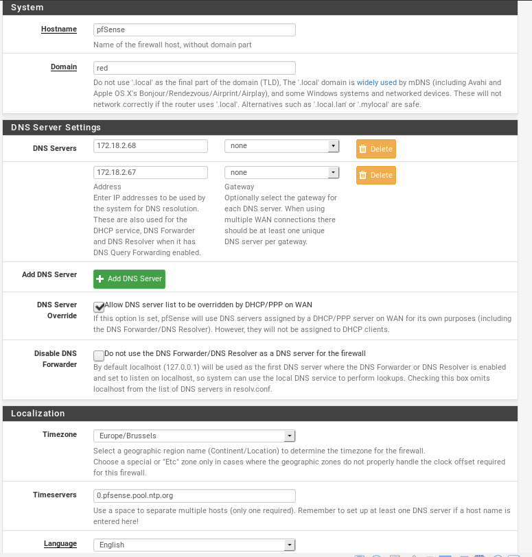

# Configuratie pfSense

We gaan de firewall configureren met volgende instellingen:
- Keymap: `be.iso.kbd: Belgian ISO-8859-1`
- Partitioning: `Auto (UFS)`

**Hierna wordt pfSense geïnstalleerd.**

Na het heropstarten:

1. "Enter the parent interface name for the new VLAN (or nothing if finished):"
Druk hierna op `<Enter>`.

2. We steken een kabel in, in `bge0`, zodat deze de WAN-interface wordt.

3. We veranderen het IP-adres (niet default 192.168.1.1/24) door te kiezen voor `2) Set interface(s) IP address`.

### Configuratie WAN-interface

We kiezen voor `1 - WAN (em0 - static)`.

- `Configure IPv4 address WAN interface via DHCP? (y/n)`: 

  Geef `n` in.
  
- `Enter the new WAN IPv4 address. Press <ENTER> for none:`:

  Geef `172.18.2.114/28` in.
  
- `Enter the new WAN IPv4 subnet bit count (1 to 31):`:

  Geef `28` in.
  
- `For a WAN, enter the new WAN IPv4 upstream gateway address.`:

  Geef `172.18.2.113` in.
  
- `Configure IPv6 address WAN interface via DHCP? (y/n)`: 

  Geef `n` in.
  
- `Enter the new WAN IPv6 address. Press <ENTER> for none:`:

  Druk op `Enter`.
  
- `Do you want to revert to HTTP as the webConfigurator protocol? (y/n)`:

   Geef `n` in.
  
 Hierna worden de instellingen toegepast.
 
 ### Configuratie LAN-interface
 
 We kiezen voor `2 - LAN (em1 - static)`.
  
  
- `Enter the new LAN IPv4 address. Press <ENTER> for none:`:

  Geef `172.18.2.98/28` in.
  
- `Enter the new WAN IPv4 subnet bit count (1 to 31):`:

  Geef `28` in.
  
- `For a LAN, press <ENTER> for none:`:

  Druk op `Enter`.
  
- `Enter the new LAN IPv6 address. Press <ENTER> for none:`:

  Druk op `Enter`.
  
- `Do you want to enable the DHCP server on LAN? (y/n)`:

  Geef `n` in.
  
- `Do you want to revert to HTTP as the webConfigurator protocol? (y/n)`:

   Geef `n` in.  

 Hierna worden de instellingen toegepast.
 

Ook verbinden we een 2de kabel met een hostmachine (geef deze een IP-adres van `172.18.2.99`.)

[Zie IP-adressen schema](https://github.com/HoGentTIN/p3ops-red/blob/master/Netwerk/files/Lokaal%20netwerk/VLSM-red.pdf)

*Onderste poort is WAN, bovenste is LAN.*

## Basisconfiguratie pfSense

We overlopen de `Setup Wizard` in `System`.

1. Klik op `Next`.
2. Klik nogmaals op `Next`.
3. We vullen `General Information` in:

- Hostname: `pfSense`
- Domain: `red`
- Primary DNS Server: `172.18.2.67`
- Secondary DNS Server: `172.18.2.68`

4. Bij `Time Server Information` veranderen we Timezone naar `Europe/Brussels`.
5. De instellingen bij `Configure WAN Interface` zouden al ingesteld moeten zijn en hier veranderen we dus niets.
6. Ditto voor `Configure LAN Interface`.
7. Indien nodig kan je het paswoord wijzigen bij `Set Admin WebGUI Password`: we geven `pfsense` in.
8. Klik op `Next`, nu kan je de server reloaden met `Reload`.

# Afbeeldingen + verloop

## Interfaces

### Interfaces / WAN

## System / Advanced / Admin Access
<!--

-->
**Alternate hostname: zonder spaties!**

## System / General Setup

**Do not use the DNS Forwarder/DNS Resolver!**

## System / Routing / Gateways

We passen hier de `Description`aan, dit is optioneel.

## Services / DNS Resolver / General Settings

Disable de DNS resolver.

**Schakel DNS Forwarder bij "Services" ook uit (indien dit vooraf nog niet gebeurde)!**

<!--
## Wizard

-->

## Aliassen

`Firewall` -> `Aliases` -> `IP`

`Firewall` -> `Aliases` -> `Ports`

<!--
Teveel ports... rond 5-6 ports nodig

**Opmerking:** 
- `Dynamic (TCP/UDP)` werd nog niet toegevoegd voor DC's.
- `High port ranges 49152-65535 and 1024-5000` werden nog niet toegevoegd voor monitoring-server.
-->

## Rules

`Firewall` -> `Rules`

We voegen enkele poorten toe:

- Source: `LAN net`
- Destination Port: (zie afbeelding hieronder)

[PDF alle geconfigureerde rules LAN](files/Firewall_rules-LAN.pdf)

<!-- Verouderd

-->

## Routes

*Om enkel te controleren of de routes in orde zijn, kunnen we tijdelijk het filteren van de packets uitschakelen.* Advanced -> Firewall & NAT.

We voegen routes toe naar VLAN 200, 300, 500 en 999 (native). Er staan ook routes naar netwerk `0.0.0.0/1` en `128.0.0.0/1` in, dit om een default static route te simuleren (`0.0.0.0/0` is niet mogelijk in pfSense). Hiernaast is er ook een route naar `172.18.0.0/16` om alles te routeren binnen `red.local`. Deze 3 routes zijn uitgeschakeld en worden dus niet toegepast op de firewall.

## Gateways

We hebben ook 3 gateways gedefinieerd; 2 WAN en 1 LAN gateway.

`GW_ROUTERIN` 172.18.2.97 dient als gateway voor het intern verkeer (naar `red.local`), `WAN_DHCP6` dient voor IPv6 en is uitgeschakeld. `WANGW` is de default gateway en al het verkeer dat niet bestemd is voor `red.local` zal via deze DG naar buiten gaan.

## Backup/restore configuratie

`Diagnostics` -> `Backup & Restore`

Download configuration as XML.

**Opmerking:** Het is mogelijk dat na het restoren van de backup dat de firewall packages wilt installeren van het internet, dit is niet noodzakelijk. Cancel deze installatie/updates dus. Dit moet je zeker doen als er nog geen internetverbinding is (want dit zou toch niet lukken).

Kies hierbij voor "Clear package lock".