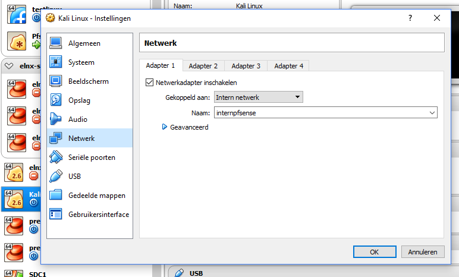

# Creatie VM Pfsense + Webgui verkrijgen

1. eerst gaan we een standaarinstallatie uitvoeren van `kali linux` en `pfsense` (nieuwste versie). Hiervoor downloaden we voor beide een iso.

* https://www.pfsense.org/download/

* https://www.kali.org/downloads/ (kies de 64 bit LIGHT versie)

2. Zorg nu voor een standaardinstallatie van beide boxen, stel nog niets in op `pfsense` en schakel beide vm's uit.

3. We kijken eerst naar de instellingen voor PFSense. In het netwerkgedeelte stellen we het volgende in:

- voor de WAN kan je kiezen voor `intern netwerk` genaamd `externpfsense` of NAT of Bridged network

- voor de LAN kies je voor `intern netwerk` genaamd `internpfsense`.

4. Vervolgens starten we PFSense op en kiezen we voor optie 2 in het menu (assign ip). We kiezen ervoor om

- WAN: 172.18.2.114 /28 als ip van pfsense + verwijzing naar default-gateway 172.18.2.113

- LAN: 172.18.2.98 /28 + DHCP erbij instellen (ik heb nu gekozen om in dat subnet ip's uit te delen tussen 172.18.2.98-102).

Na deze instelling krijgen we mee dat we op de WEBGUI zullen geraken via het adres http://172.18.2.98

5. Laat Pfsense aanstaan, nu gaan we de netwerkkaart van Kali Linux als volgt instellen:

- we koppelen deze aan het `intern netwerk` met naam `internpfsense`

6. Nu starten we Kali Linux op, loggen in als `root` met het root-paswoord. Vervolgens checken we of we nu via `internpfsense` een ip hebben gekregen van de DHCP van pfsense. Normaal is dit direct in orde en kunnen we in firefox surfen naar het adres 172.18.2.98!

