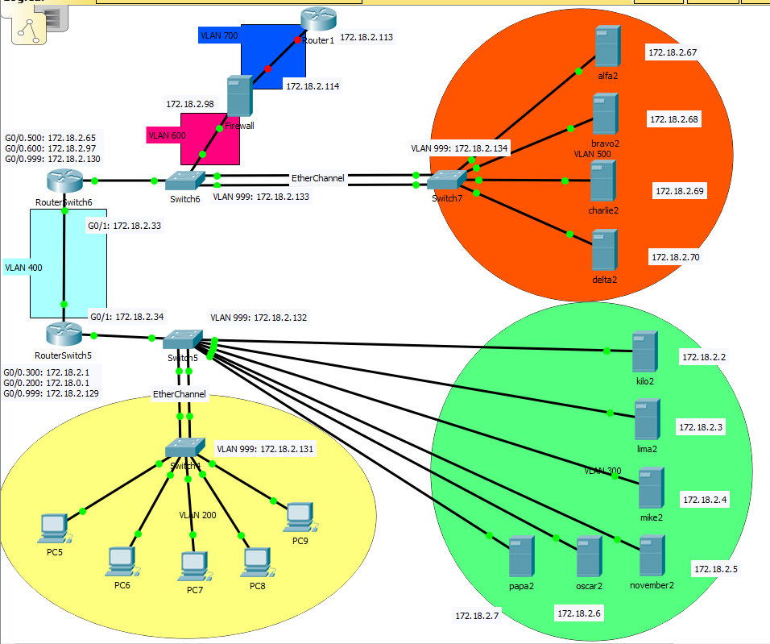

# Netwerk

## Packettracer

In deze map kan u alle informatie (configuratie, overzicht IP-adressering, Packet Tracer, documentatie etc.) over het lokaal en niet-lokaal netwerk vinden.

In de [PDF](https://github.com/HoGentTIN/p3ops-red/blob/master/Netwerk/files/Lokaal%20netwerk/VLSM-red.pdf) of [Markdown](https://github.com/HoGentTIN/p3ops-red/blob/master/Netwerk/files/Lokaal%20netwerk/VLSM-red.md) (eigen voorkeur, in beide bestanden staat hetzelfde) van `VLSM-red` kan je terugvinden hoe alles verdeeld is en welke IP-adressen je kan gebruiken voor de servers.

In de map `configuraties` kan je de tekstbestanden terugvinden voor alle switches en routers die we zullen configureren + extra uitleg waarom die op die manier geconfigureerd is. 

#### Afbeelding

