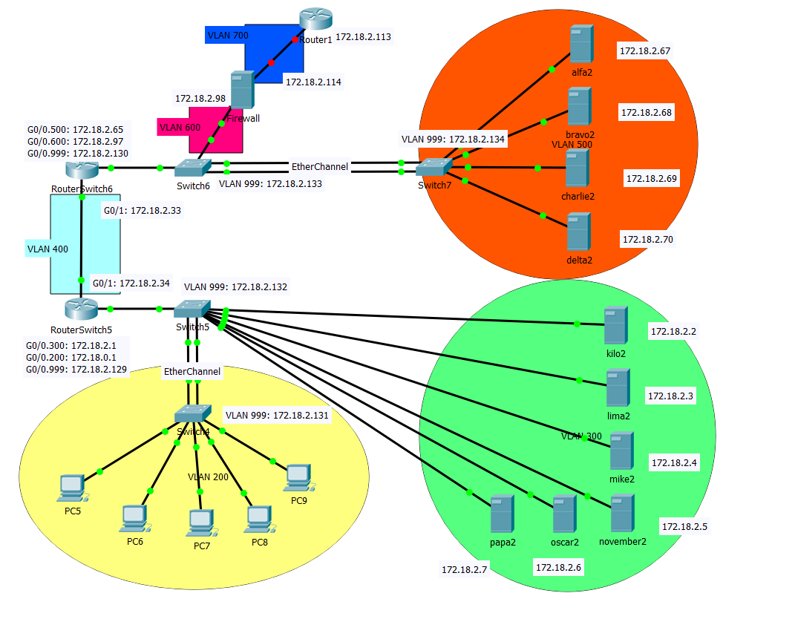
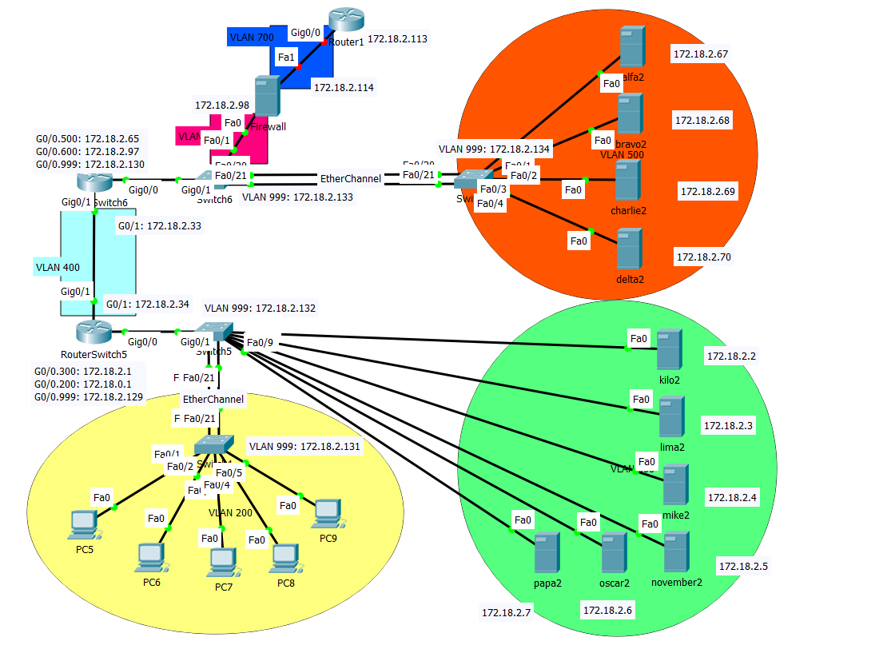

# VLSM red.local 172.18.0.0 /16

Rangschikking: Groot naar klein # IP-adressen

| Nr. subnet | Naam subnet | Netwerkadres | Subnetmask (decimaal) | Subnetmask CIDR-notatie |
| --- | --- | --- | --- | --- |
|  0 | VLAN 200 | 172.18.0.0 **Via DHCP** | 255.255.254.0 | /23 |
|  1 | VLAN 300 | 172.18.2.0 | 255.255.255.224 | /27 |
| 2 | VLAN 400 | 172.18.2.32 | 255.255.255.224 | /27 |
| 3 | VLAN 500 | 172.18.2.64 | 255.255.255.224 | /27 |
| 4 | VLAN 600 | 172.18.2.96 | 255.255.255.240 | /28 |
| 5 | VLAN 700 | 172.18.2.112 | 255.255.255.240 | /28 |
| 6 | VLAN 999 (Native) | 172.18.2.128 | 255.255.255.240 | /28 |

Geschatte aantal hosts (heel veel op reserve):

- VLAN 200: 512
- VLAN 300: 32
- VLAN 400: 32
- VLAN 500: 32
- VLAN 600: 16
- VLAN 700: 16

# Statische IP&#39;s:

## VLAN 999 (/28)

RouterSwitch5: G0/0.999: `172.18.2.129`

RouterSwitch6: G0/0.999: `172.18.2.130`

- Switch4: `172.18.2.131`
- Switch5: `172.18.2.132`
- Switch6: `172.18.2.133`
- Switch7: `172.18.2.134`

## VLAN 700 (/28)

Router1 G0/0: `172.18.2.113`

Zulu2 Firewall NIC1 (WAN): `172.18.2.114`

### VLAN 600 (/28)

RouterSwitch6: G0/0.600: `172.18.2.97`

Zulu2 Firewall NIC2 (LAN): `172.18.2.98`

### VLAN 500 (/27)

RouterSwitch6: G0/0.500: `172.18.2.65`

| Server | IP-adres | 
| --- | --- |
| Alfa2 | `172.18.2.67` |
| Bravo2 | `172.18.2.68` |
| Charlie2 | `172.18.2.69` |
| Delta2 | `172.18.2.70` |

### VLAN 400 (/27)

RouterSwitch6: G0/1: `172.18.2.33`

RouterSwitch5: G0/1: `172.18.2.34`

### VLAN 300 (/27)

RouterSwitch5: G0/0.300: `172.18.2.1`

| Server | IP-adres | 
| --- | --- |
| Kilo2 | `172.18.2.2` |
| Lima2 | `172.18.2.3` |
| Mike2 | `172.18.2.4` |
| November2 | `172.18.2.5` |
| Oscar2 | `172.18.2.6` |
| Papa2 | `172.18.2.7` |

### VLAN 200 (/23)

RouterSwitch5: G0/0.200: `172.18.0.1`

**Opmerkingen** :

- De Multilayer switch (MLS) zal vervangen worden door een switch &amp; router.
- Op Fa0/20-21 (en/of 22-23) van iedere switch wordt er een EtherChannel-verbinding geconfigureerd.
- VLAN-specifieke interfaces werden verwijderd.

## Opstelling zonder interfaces

## Opstelling met interfaces

