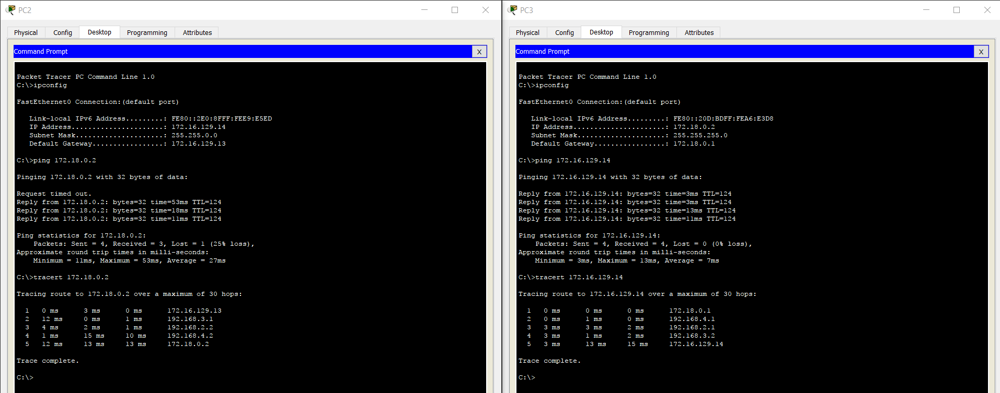

# Testrapport routers

* Verantwoordelijke uitvoering testrapport: Laurens Bracke

## Testen

## Overeenkomst Packet-tracer met brochure:

Opstelling brochure:


Opstelling Packet-tracer:


- Opstellingen komen overeen


## Configuratie routers:

IK MIS BIJ ELKE ROUTER WEL BEVEILIGING VAN SSH EN/OF CONSOLE PASWOORDEN

### Router4

Deze router heeft juiste config qua poorten, weet momenteel niet of het genoeg is om naar buiten te gaan via de cloud

```
ROUTER4#show running-config
Building configuration...

Current configuration : 760 bytes
!
version 12.2
no service timestamps log datetime msec
no service timestamps debug datetime msec
no service password-encryption
!
hostname ROUTER4
!
no ip cef
no ipv6 cef
!
!
!
!
interface FastEthernet0/0
 no ip address
 duplex auto
 speed auto
 shutdown
!
interface Serial0/0
 no ip address
 clock rate 2000000
 shutdown
!
interface Serial0/1
 ip address 192.168.1.1 255.255.255.0
!
interface Serial0/2
 ip address 192.168.0.1 255.255.255.0
!
interface Serial0/3
 no ip address
 clock rate 2000000
 shutdown
!
ip classless
ip route 192.168.1.0 255.255.255.0 192.168.1.2
ip route 192.168.0.0 255.255.255.0 192.168.0.2
!
ip flow-export version 9
!
!
line con 0
!
line aux 0
!
line vty 0 4
 login
!
!
end

```

### Router 3

Poorten zijn correct ingesteld

```
ROUTER3#show running-config
Building configuration...

Current configuration : 841 bytes
!
version 12.2
no service timestamps log datetime msec
no service timestamps debug datetime msec
no service password-encryption
!
hostname ROUTER3
!
!
!
no ip cef
no ipv6 cef
!
!
!
!
interface FastEthernet0/0
 no ip address
 duplex auto
 speed auto
 shutdown
!
interface Serial0/0
 ip address 192.168.0.2 255.255.255.0
 clock rate 2000000
!
interface Serial0/1
 ip address 192.168.4.1 255.255.255.0
!
interface Serial0/2
 ip address 192.168.2.2 255.255.255.0
 clock rate 2000000
!
interface Serial0/3
 no ip address
 clock rate 2000000
 shutdown
!
ip classless
ip route 192.168.0.0 255.255.255.0 192.168.0.1
ip route 192.168.2.0 255.255.255.0 192.168.2.1
ip route 192.168.4.0 255.255.255.0 192.168.4.2
!
ip flow-export version 9
!
!
line con 0
!
line aux 0
!
line vty 0 4
 login
!
!
!
end

```

### Router1

Bij hetgene wat ik terugvind, zijn alle poorten goed, behalve de VPN poort is niet ingesteld. Kan dus momenteel ook VPN niet testen.

```

ROUTER1#show running-config
Building configuration...

Current configuration : 907 bytes
!
version 12.2
no service timestamps log datetime msec
no service timestamps debug datetime msec
no service password-encryption
!
hostname ROUTER1
!
!
no ip cef
no ipv6 cef
!
!
!
!
interface FastEthernet0/0
 no ip address
 duplex auto
 speed auto
 shutdown
!
interface Serial0/0
 ip address 192.168.4.2 255.255.255.0
 clock rate 2000000
!
interface Serial0/1
 no ip address
 clock rate 2000000
 shutdown
!
interface Serial0/2
 no ip address
 clock rate 2000000
 shutdown
!
interface Serial0/3
 no ip address
 clock rate 2000000
 shutdown
!
interface FastEthernet1/0
 ip address 172.18.2.113 255.255.0.0
 duplex auto
 speed auto
!
interface FastEthernet1/1
 no ip address
 duplex auto
 speed auto
 shutdown
!
ip classless
ip route 192.168.4.0 255.255.255.0 192.168.4.1
!
ip flow-export version 9
!
!
line con 0
!
line aux 0
!
line vty 0 4
 login
!
!
!
end
```

## Lukt het pingen van PC2 naar PC3 en omgekeerd??

- IP van PC3


- IP van PC2


- De ping tussen de 2 pc's wilt niet werken! loopt vast bij Router1

## VPN-configuratie testen?


# Tweede iteratie testrapport

* Verantwoordelijke uitvoering testrapport: Robin Bauwens

## Testen


De opstelling in PT (apparaten) is ongewijzigd, de configuratie werd enkel aangepast bij de PC's en Router3 + Router4.

### Router0

```
Router0#show run
Building configuration...

Current configuration : 1305 bytes
!
version 15.1
no service timestamps log datetime msec
no service timestamps debug datetime msec
no service password-encryption
!
hostname Router0
!
!
!
!
!
!
!
!
no ip cef
no ipv6 cef
!
!
!
!
license udi pid CISCO1941/K9 sn FTX152441K9
!
!
!
!
!
!
!
!
!
ip ssh version 2
ip domain-name SSH1
!
!
spanning-tree mode pvst
!
!
!
!
!
!
interface GigabitEthernet0/0
 no ip address
 duplex auto
 speed auto
 shutdown
!
interface GigabitEthernet0/1
 ip address 172.16.129.13 255.255.0.0
 duplex auto
 speed auto
!
interface Serial0/0/0
 no ip address
 clock rate 2000000
 shutdown
!
interface Serial0/0/1
 no ip address
 clock rate 2000000
 shutdown
!
interface Serial0/1/0
 ip address 192.168.3.2 255.255.255.0
!
interface Serial0/1/1
 no ip address
 clock rate 2000000
 shutdown
!
interface Vlan1
 no ip address
 shutdown
!
ip classless
ip route 192.168.2.0 255.255.255.0 192.168.3.1 
ip route 192.168.1.0 255.255.255.0 192.168.3.1 
ip route 192.168.0.0 255.255.255.0 192.168.3.1 
ip route 192.168.4.0 255.255.255.0 192.168.3.1 
ip route 172.18.0.0 255.255.255.0 192.168.3.1 
ip route 0.0.0.0 0.0.0.0 192.168.3.1 
!
ip flow-export version 9
!
!
!
!
!
!
!
line con 0
 password cisco
 login
!
line aux 0
!
line vty 0 4
 login local
 transport input ssh
line vty 5 15
 login local
 transport input ssh
!
!
!
end
```

### Router1

```
Router1#show run
Building configuration...

Current configuration : 1306 bytes
!
version 15.1
no service timestamps log datetime msec
no service timestamps debug datetime msec
no service password-encryption
!
hostname Router1
!
!
!
!
!
!
!
!
no ip cef
no ipv6 cef
!
!
!
!
license udi pid CISCO1941/K9 sn FTX15244UJQ
!
!
!
!
!
!
!
!
!
ip ssh version 2
ip domain-name SSH1
!
!
spanning-tree mode pvst
!
!
!
!
!
!
interface GigabitEthernet0/0
 no ip address
 duplex auto
 speed auto
 shutdown
!
interface GigabitEthernet0/1
 ip address 172.18.0.1 255.255.255.0
 duplex auto
 speed auto
!
interface Serial0/0/0
 no ip address
 clock rate 2000000
 shutdown
!
interface Serial0/0/1
 ip address 192.168.4.2 255.255.255.0
!
interface Serial0/1/0
 no ip address
 clock rate 2000000
 shutdown
!
interface Serial0/1/1
 no ip address
 clock rate 2000000
 shutdown
!
interface Vlan1
 no ip address
 shutdown
!
ip classless
ip route 172.16.129.0 255.255.255.0 192.168.4.1 
ip route 192.168.2.0 255.255.255.0 192.168.4.1 
ip route 192.168.3.0 255.255.255.0 192.168.4.1 
ip route 192.168.0.0 255.255.255.0 192.168.4.1 
ip route 192.168.1.0 255.255.255.0 192.168.4.1 
ip route 0.0.0.0 0.0.0.0 192.168.4.1 
!
ip flow-export version 9
!
!
!
!
!
!
!
line con 0
 password cisco
 login
!
line aux 0
!
line vty 0 4
 login local
 transport input ssh
line vty 5 15
 login local
 transport input ssh
!
!
!
end
```

### Router2

```
Router2#show ru
Building configuration...

Current configuration : 1291 bytes
!
version 15.1
no service timestamps log datetime msec
no service timestamps debug datetime msec
no service password-encryption
!
hostname Router2
!
!
!
!
!
!
!
!
no ip cef
no ipv6 cef
!
!
!
!
license udi pid CISCO1941/K9 sn FTX1524UA12
!
!
!
!
!
!
!
!
!
ip ssh version 2
ip domain-name SSH1
!
!
spanning-tree mode pvst
!
!
!
!
!
!
interface GigabitEthernet0/0
 no ip address
 duplex auto
 speed auto
 shutdown
!
interface GigabitEthernet0/1
 no ip address
 duplex auto
 speed auto
 shutdown
!
interface Serial0/0/0
 ip address 192.168.1.2 255.255.255.0
 clock rate 2000000
!
interface Serial0/0/1
 no ip address
 clock rate 2000000
 shutdown
!
interface Serial0/1/0
 ip address 192.168.3.1 255.255.255.0
 clock rate 2000000
!
interface Serial0/1/1
 ip address 192.168.2.1 255.255.255.0
 clock rate 2000000
!
interface Vlan1
 no ip address
 shutdown
!
ip classless
ip route 172.16.129.0 255.255.255.0 192.168.3.2 
ip route 192.168.0.0 255.255.255.0 192.168.1.1 
ip route 172.18.0.0 255.255.255.0 192.168.2.2 
ip route 0.0.0.0 0.0.0.0 192.168.1.1 
ip route 192.168.4.0 255.255.255.0 192.168.2.2 
!
ip flow-export version 9
!
!
!
!
!
!
!
line con 0
 password cisco
 login
!
line aux 0
!
line vty 0 4
 login local
 transport input ssh
line vty 5 15
 login local
 transport input ssh
!
!
!
end
```

### Router3

```
router3#show run
Building configuration...

Current configuration : 1298 bytes
!
version 15.1
no service timestamps log datetime msec
no service timestamps debug datetime msec
no service password-encryption
!
hostname router3
!
!
!
!
!
!
!
!
no ip cef
no ipv6 cef
!
!
!
!
license udi pid CISCO1941/K9 sn FTX152492C2
!
!
!
!
!
!
!
!
!
ip ssh version 2
ip domain-name SSH1
!
!
spanning-tree mode pvst
!
!
!
!
!
!
interface GigabitEthernet0/0
 no ip address
 duplex auto
 speed auto
 shutdown
!
interface GigabitEthernet0/1
 no ip address
 duplex auto
 speed auto
 shutdown
!
interface Serial0/0/0
 ip address 192.168.4.1 255.255.255.0
 clock rate 2000000
!
interface Serial0/0/1
 no ip address
 clock rate 2000000
 shutdown
!
interface Serial0/1/0
 ip address 192.168.0.2 255.255.255.0
!
interface Serial0/1/1
 ip address 192.168.2.2 255.255.255.0
!
interface Vlan1
 no ip address
 shutdown
!
ip classless
ip route 172.16.129.0 255.255.255.0 192.168.2.1 
ip route 192.18.0.0 255.255.255.0 192.168.4.2 
ip route 192.168.3.0 255.255.255.0 192.168.2.1 
ip route 192.168.1.0 255.255.255.0 192.168.0.1 
ip route 0.0.0.0 0.0.0.0 192.168.0.1 
ip route 172.18.0.0 255.255.255.0 192.168.4.2 
!
ip flow-export version 9
!
!
!
!
!
!
!
line con 0
 password cisco
 login
!
line aux 0
!
line vty 0 4
 login local
 transport input ssh
line vty 5 15
 login local
 transport input ssh
!
!
!
end
```
### Router4

```
Router4#show run
Building configuration...

Current configuration : 1251 bytes
!
version 15.1
no service timestamps log datetime msec
no service timestamps debug datetime msec
no service password-encryption
!
hostname Router4
!
!
!
!
!
!
!
!
no ip cef
no ipv6 cef
!
!
!
!
license udi pid CISCO1941/K9 sn FTX152439ZP
!
!
!
!
!
!
!
!
!
ip ssh version 2
ip domain-name SSH1
!
!
spanning-tree mode pvst
!
!
!
!
!
!
interface GigabitEthernet0/0
 no ip address
 duplex auto
 speed auto
 shutdown
!
interface GigabitEthernet0/1
 no ip address
 duplex auto
 speed auto
 shutdown
!
interface Serial0/0/0
 ip address 192.168.1.1 255.255.255.0
!
interface Serial0/0/1
 no ip address
 clock rate 2000000
 shutdown
!
interface Serial0/1/0
 ip address 192.168.0.1 255.255.255.0
 clock rate 2000000
!
interface Serial0/1/1
 no ip address
 clock rate 2000000
!
interface Vlan1
 no ip address
 shutdown
!
ip classless
ip route 192.168.2.0 255.255.255.0 192.168.0.2 
ip route 192.168.3.0 255.255.255.0 192.168.1.2 
ip route 192.168.4.0 255.255.255.0 192.168.0.2 
ip route 172.16.129.0 255.255.255.0 192.168.1.2 
ip route 172.18.0.0 255.255.255.0 192.168.0.2 
!
ip flow-export version 9
!
!
!
!
!
!
!
line con 0
 password cisco
!
line aux 0
!
line vty 0 4
 login local
 transport input ssh
line vty 5 15
 login local
 transport input ssh
!
!
!
end
``` 

## Voorgaande problemen en wijzigingen configuratie

[Zie verslag troubleshooting](https://github.com/HoGentTIN/p3ops-red/blob/master/Netwerk/configuratie%20routers%20%2B%20VPN/Verslag%20troubleshooting%20niet-lokaal%20netwerk.md)

- We merken ook op dat `GigabitEthernet 0/1` IP-adres `172.16.129.13` toegekend werd.

- De paswoorden zijn voor de routers zijn `cisco`.


## Testen connectiviteit

- We merken op (in de `running-config`) dat de poorten die verbonden zijn met andere apparaten een (correct) IP-adres hebben gekregen + niet op `shutdown` staan.
- Er telkens een werkende `ip route` is naar alle niet-direct verbonden netwerken (zie `running-config`).



