# Handleiding WISA-server

Welkom bij deze handleiding voor het opzeten van een WISA-server. U kan deze handleiding gebruiken voor het testen van uw programma's in een virtuele omgeving, zodat deze in de realiteit geen problemen meet met zich zal meebrengen.
Deze handleiding heeft 5 grote stappen:

1. Voor we starten
2. Installatie Windows Server 2012 R2
3. Installatie IIS en ASP.NET
4. Installatie MySQL
5. Applicatie doen runnen op WISA

Laten we beginnen bij het begin!

## Voor we starten

### Welke programma's hebben we nodig?

Om een virtuele testomgeving te maken is het nodig om enkele programma's op voorhand te installeren. Zo zijn er:

1. [Git](https:]//git-scm.com/downloads) - Dit programma (meer bepaald Git Bash, de opdrachtprompt) gaan we gebruiken om alle commando's op de hostmachine in te geven. Van hieruit kunnen we onze virtuele machine sturen en bevelen laten opvolgen.

2. [VirtualBox](https://www.virtualbox.org/wiki/Downloads) - Dit is het programma dat de virtuele machine zal opstarten, zorgen dat het blijft draaien en stoppen wanneer nodig.

3. [Vagrant](https://www.vagrantup.com/downloads.html) - Dit programma hebben we nodig, want dit programma bevat alle commando's die we gaan gebruiken voor de virtuele machine in Git Bash.

Installeer ze in deze volgorde. 

### Wat is de startsituatie op mijn (host)pc?

Nu alle nodige programma's zijn geïnstalleerd, gaan we kijken wat we allemaal gaan gebruiken tijdens de installatie van WISA.
Zo hebben we nodig:

- Git Bash: Normaal kan je dit terugvinden op je bureaublad, of vind je het via de zoekfunctie van je hostmachine. Je kan nu al testen in Git Bash of de installatie van Vagrant gelukt is, dan krijg je volgende uitvoer.

- De map [files](https://github.com/HoGentTIN/p2ops-g04/tree/master/opdracht02/WISA/files) hebben we ook nodig, hierin staan alle scripts die we laten uitvoeren na Stap 2 van deze handleiding. Meer info hierover later wat te doen met deze map.

### Afspraken tijdens de installatie

Uitvoeren .bat: selecteer het bestand en druk op `<Enter>`.

Uitvoeren .ps1 : selecteer het bestand, rechtermuisklik en `Run with PowerShell`.

## Installatie Windows Server 2012 R2

##Virtuele machine downloaden en plaatsje geven op jouw hostmachine

Voor deze WISA hebben we in deze handleiding een virtuele machine nodig van Windows Server 2012 R2.

Laten we starten!

Stap 1: Maak een map aan ergens op je hostmachine. Ik heb nu gekozen om deze op mijn bureaublad te maken, maar je bent zelf volledig vrij om te kiezen waar.

Stap 2: Je gaat in deze map en roept het opties-menu op door te klikken op de rechtermuisknop. Hier staat normaal de optie "GIT Bash here". Klik hierop!

Stap 3: Normaal kom je nu terecht in een tekstomgeving zoals de normale opdrachtprompt op je pc. Hierin zullen we alle commando's ingeven voor onze virtuele machine. Je ziet ook dat we ons nu in deze nieuwe map bevinden!

Stap 4: Voor volgend commando uit:  `vagrant init kensykora/windows_2012_r2_standard`. Hiermee maken we een vagrant-file aan in deze nieuwe map. Dit zet alles klaar om de virtuele machine op te starten. 

Stap 5: Voer vervolgens uit: `vagrant box add kensykora/windows_2012_r2_standard` uit. Nu wordt Windows Server normaal gezien gedownload van het internet. Dit kan enige tijd in beslag nemen.

Stap 6: Ga naar de map `C:\Users\(naam van jouw pc)\.vagrant.d\boxes\kensykora-VAGRANTSLASH-windows_2012_r2_standard/0.7.0/virtualbox/` en open `Vagrantfile` in kladblok (of een andere tekstbewerker).
Daar kan je op lijn 48 terugvinden `#v.gui = true` maar het staat nog in commentaar! Dit gaan we uit commentaar halen (haal `#` weg) omdat wij gaan werken met de grafische interface van Windows Server 2012

Stap 7: 
Typ vervolgens: `vagrant up` in Git BASH (hiermee start je de VM werkelijk op, indien dit niet werkt, typ dan: `vagrant global-status` om het ID te weten en typ dan: `vagrant up <id>`.
Voer `vagrant halt (<id>)` uit om de VM af te zetten indien je dat wenst!

Normaal zou nu Virtualbox de VM opstarten.

Stap 8: Nu gaan we via de de grafische interface inloggen. Pas op! Het toetsenbord staat nog in QWERTY (dit passen we later aan).
De gebruiker heet `vagrant` en het wachtwoord is `vagrant`, maar je moet dus opletten, want je moet eigenlijk 2 maal `vqgrqnt` invoeren nu!!!

Stap 9: Typ `vagrant global-status` en `vagrant ssh-config` om de instellingen te zien van de VM (je kan dan inloggen via `vagrant ssh <id>`, en zo alles uitvoeren, maar wij werken met de GUI). Via deze gegevens gaan we dan in deel 2 inloggen op het systeem en de scripts voor de overige programma's uitvoeren!

Ziezo, nu heb je een volwaardige virtuele Windows Server draaien op jouw systeem. Proficiat!

## Installatie IIS

IIS Express is een dienst voor het draaien van webservers, die speciaal gemaakt is voor Windows Server. Meer info kan je vinden op de [site](https://www.iis.net/).

ASP.NET is een open source web framework om moderne webapplicatie mee te maken in .NET. [Meer info kan je hier](https://www.asp.net/) vinden. 

### Map met scripts verplaatsen

We hebben een map die u kan downloaden waarin alle scripts staan waarmee we een Windows Server kunnen opwaarderen tot een volwaardige WISA stack. Deze map gaan we verplaatsen in ons hostsysteem naar een andere map.
Als we dit doen, kunnen we aan de scripts geraken in de grafische interface van onze virtuele machine en zo de scripts uitvoeren op de virtuele Windows Server.

Stap 1: Plaats de folder [files](https://github.com/HoGentTIN/p2ops-g04/tree/master/opdracht02/WISA/files) van GitHub met daarin de gemaakte scripts en configuratiebestanden in de map die je helemaal in het begin hebt aangemaakt.
Bij mij was dit de map WISA op het bureaublad.

Normaal kan je nu deze map met zijn bestanden automatisch terugvinden op de virtuele machine!

### Hoofdscript uitvoeren

Stap 1: Ga naar de map files op de GUI, en voer script `mainscript.bat` uit (klik op het bestand en druk op `<Enter>`). Dit script bevat een aanroep naar andere "subscripts", die o.a. zorgen voor de installatie en bestandspermissies van folders. **Indien het scherm blijft hangen of om toestemming vraagt, druk dan op `<Enter>`.**

Eerst wordt de IIS-service en .NET geinstalleerd en wordt de layout van het toetsenbord veranderd van QWERTY naar AZERTY.

Verder wordt ook Chocolatey geïnstalleerd, dit is een soort "installatiehulp" (package manager) voor Windows.
Hiernaast wordt ook een extra folder voor de databank aangemaakt en geregeld dat je volledige toegang tot deze krijgt.
Ten slotte zorgt dit script ook voor de opstart en login van de databankservices (MySQL).

Ga naar de map `files` en voor volgend .bat-script uit:

 `mainscript.bat`: dit script voert `installeerIISDotNetVeranderKeyboard.ps1`, `installChocolateyEnMySQL.bat`, `startMySQL.bat`, login in MySQL en `loginMySQL.bat` uit.
  

 **Opmerking: niet panikeren als er rode tekst op het scherm verschijnt, het script blijft lopen en alles gaat toch correct uitgevoerd worden!**
 
 

 
 
  
  
## ExecutionPolicy

Dit zorgt ervoor dat (alle) Powershell-scripts uitvoerbaar worden op deze machine. 

## Installatie Chocolatey

## IIS en ASP.NET

Ziezo, nu is op jouw volwaardige virtuele Windows Server de service IIS en ASP.NET geïnstalleerd!

## Installatie MySQL

MySQL is de meest populaire open-source database in de wereld. Meer info kan je [hier](https://www.mysql.com/) vinden!

### Paswoord voor MySQL aanpassen en de User aanpassen

Stap 1: Verander het paswoord via MySQL(CMD) op de VM (druk gewoon op `<Enter>` om in te loggen). Vervolgens ga je volgend commando intypen als er staat: `mysql>`

`alter user 'root'@'localhost' identified by 'thebowlofpetunias';`

Stap 2: Typ vervolgens exit om uit de CMD te gaan.

# Applicatie op WISA plaatsen

1. Gebruik `choco install mssqlexpress2014sp1wt` om SQL Express te downloaden. Klik vervolgens bij Installation: `New SQL Server stand-alone installation or add features to an existing installation`, de download komt in `C:\Users\vagrant\AppData\Local\Temp\1\chocolatey\mssqlexpress2014sp1wt\1.1.0` en voer dan` C:\Users\vagrant\AppData\Local\Temp\1\chocolatey\mssqlexpress2014sp1wt\1.1.0\SQLEXPRWT_x64_ENU\SETUP.EXE` uit.

2. Installeer vervolgens SQL Server.

3. zet ook `Web Management Service` op je VM aan (op `Running`).

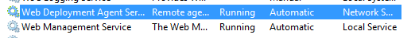

4. Open `Windows Firewall with Advanced Security` en "Enable Rule" `File and printer sharing - Echo Request ICMPv4)`, doe hetzelfde voor `Remote Desktop`.

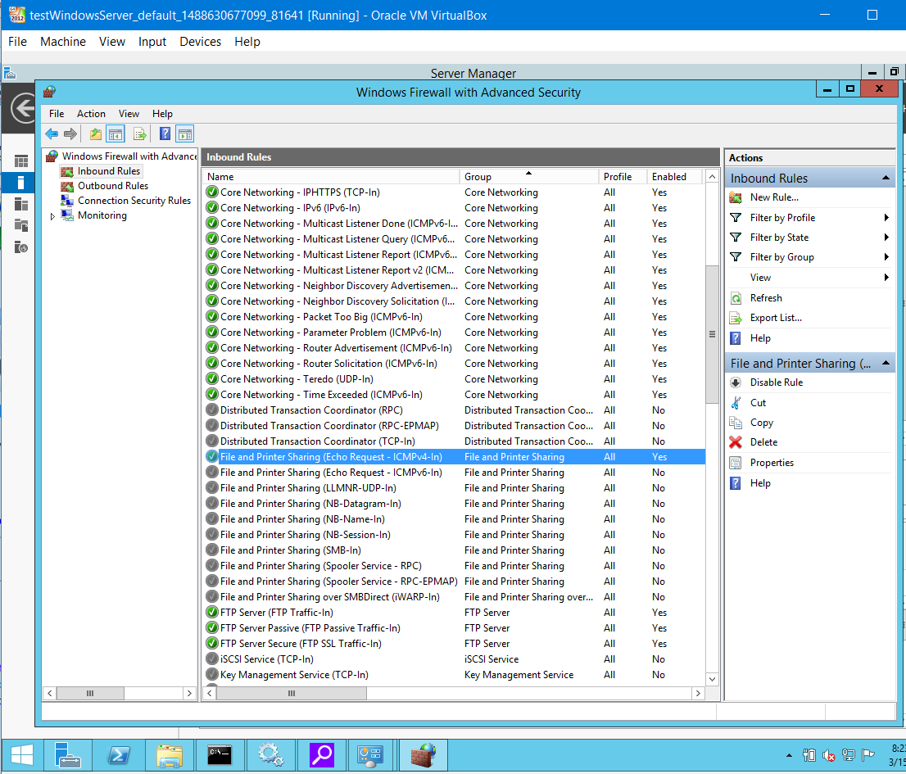

5. Installeer `Web Deploy 3.6` op je VM. Selecteer `Custom` want `Remote Service` moet ook geïnstalleerd worden.

6. Maak een nieuwe regel aan in windows firewall voor poort 80 en 8127 [zie deze tutorial](https://wiki.mcneel.com/zoo/window7firewall).

7. Installeer [Microsoft Web Platform Installer 5.0](https://www.microsoft.com/web/downloads/platform.aspx) op de VM-server. Zoek, selecteer en installeer alles van `Recommended Configuration for Hosting Providers` (dit kan even duren).

8. Typ `SQLServerManager12.msc` en volg [deze instructies](http://stackoverflow.com/questions/11278114/enable-remote-connections-for-sql-server-express-2012) of zie hieronder.

**Oude instelling**
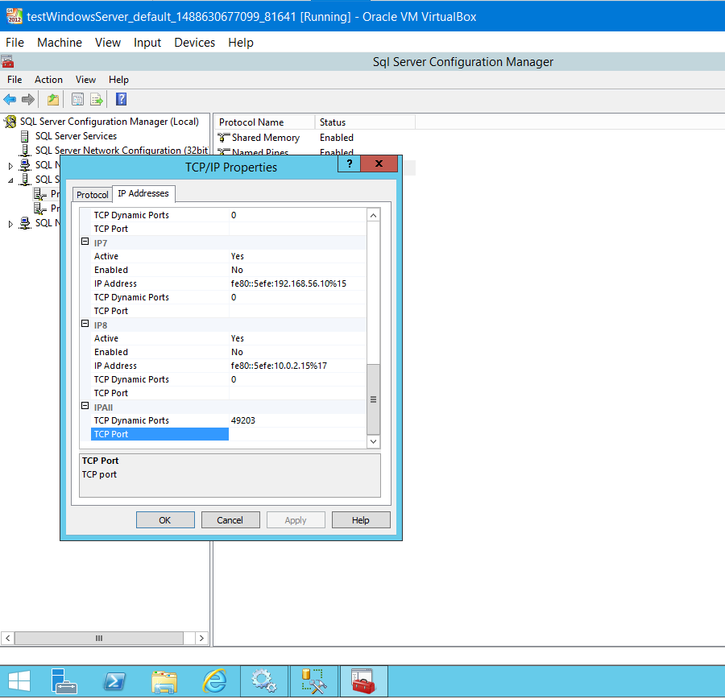

**Nieuwe instelling**
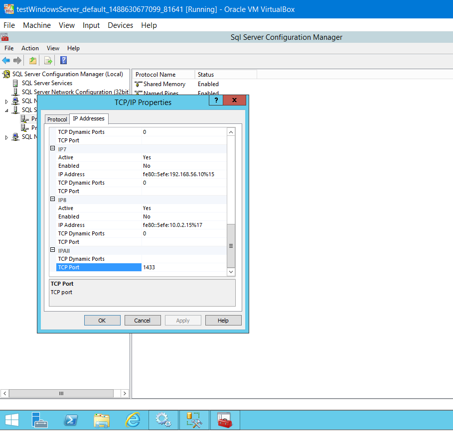

Herstart de PC (en installeer de updates).
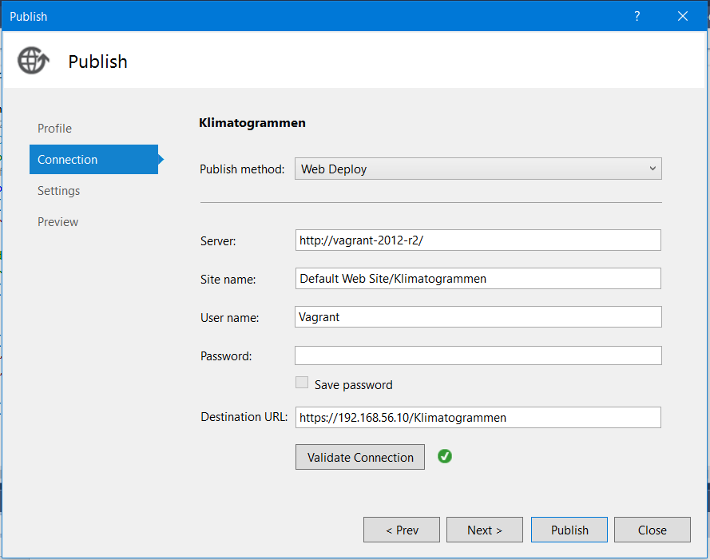

**Opmerking:** Laat Microsoft SQL Server draaien op de VM om te kunnen inloggen op de VM!

### Nu gaan we het echte project in Visual Studio klaarzetten om over te brengen naar de VM.

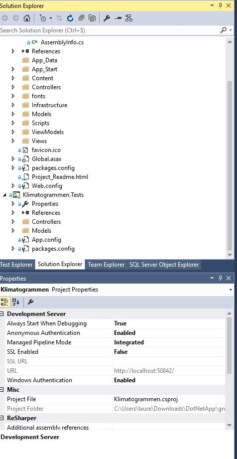

De `Properties` van het project in Visual Studio.

De instellingen voor `Connection`.

De `Settings` (vooral de databank).

Verdere databank-instellingen.

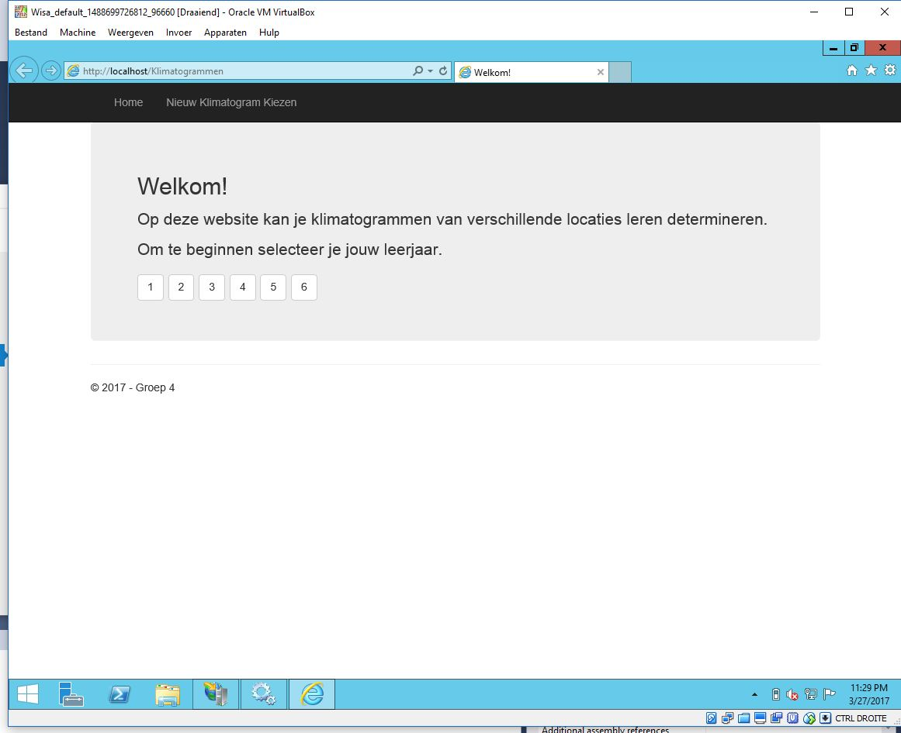

De homepagina die te zien is (gehost op Server VM).

De services die aan het draaien zijn.

IIS-instellingen.

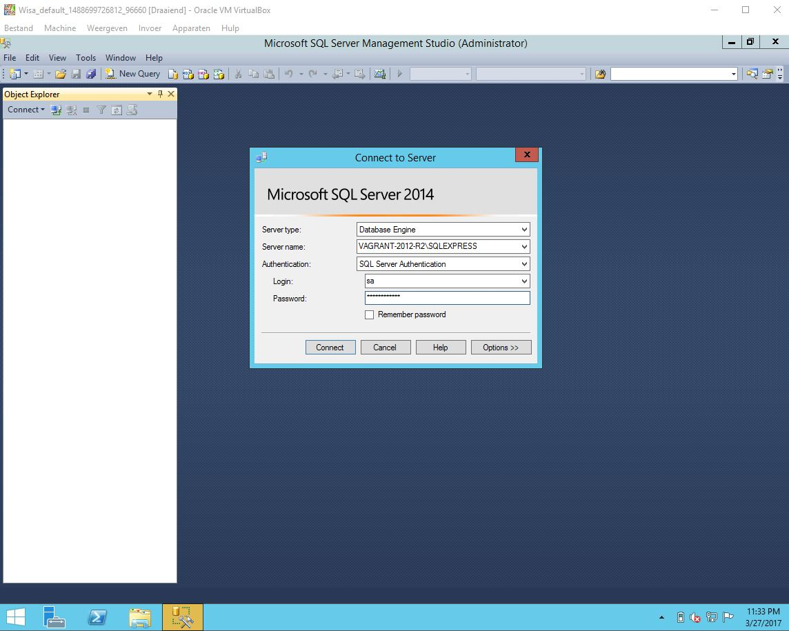

### Gebruik MS SQL Server 2014 voor deze testapplicatie. We zullen op de Vagrant gebruik maken van gebruiker SA die de databank zal aanspreken.

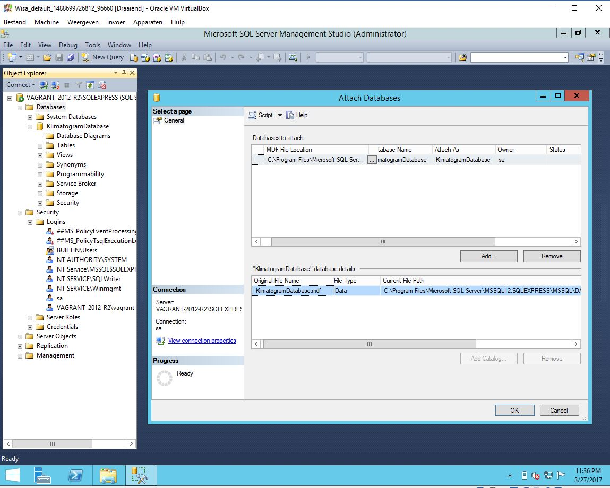

Het databankbestand `KlimatogramDatabase.mdf`, gaan we importeren in de VM, zodat ons project die databank zal aanspreken wanneer draaiende in VM.

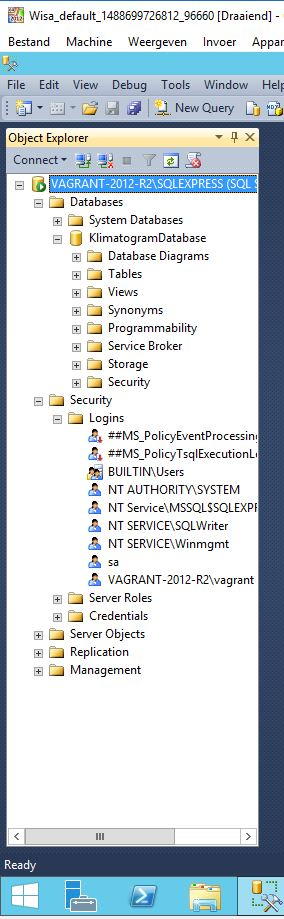

Gebruiker `sa` zal gebruikt worden voor deze demonstratie, hiervoor moeten we wel enkele instellingen veranderen, zie hieronder.

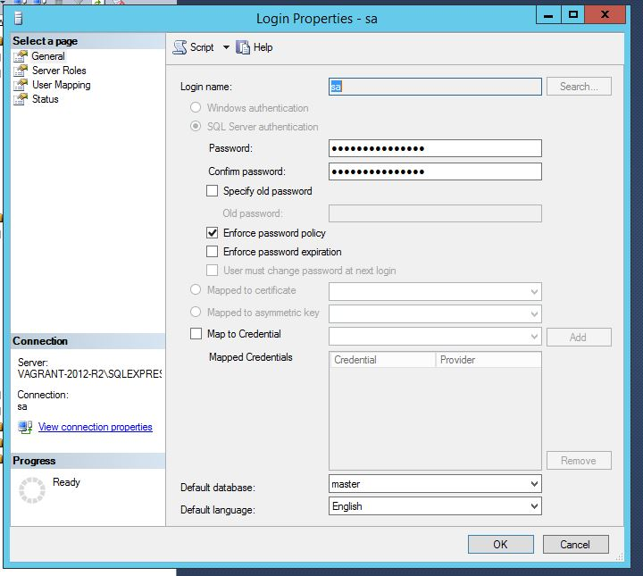

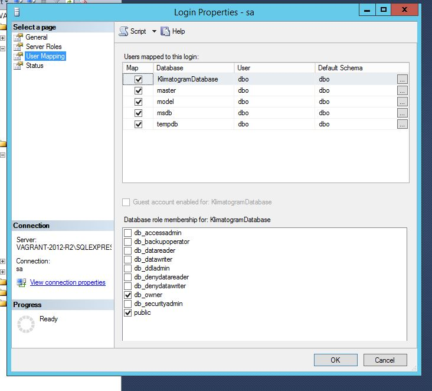

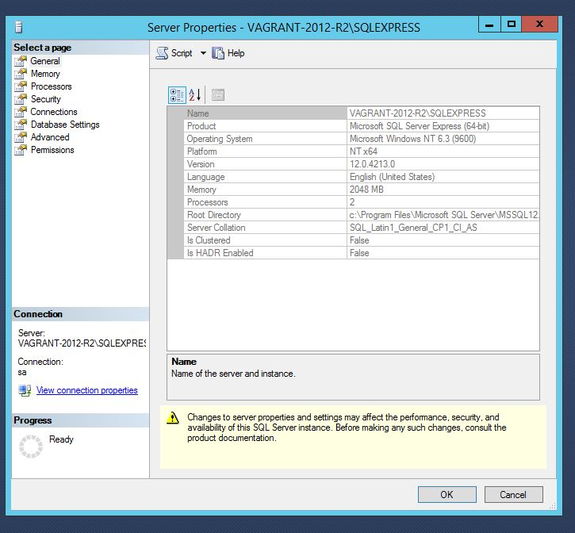

Volgende opties moeten ook correct staan om verbinding te kunnen maken met de MS SQL Server 2014 op de VM vanaf de hostmachine.

Volgende bestanden werden ook toegevoegd. Script `OpenSqlServerPort.bat` zorgt ervoor dat alle poorten die gebruikt worden (of kunnen gebruikt worden) openstaan. `database.sql` zorgt ervoor dat de databank aangemaakt wordt (indien je deze nog niet hebt geïmporteerd hebt vanuit je hostmachine).

Hieronder zijn nog enkele extra voorbeelden ter demonstratie.

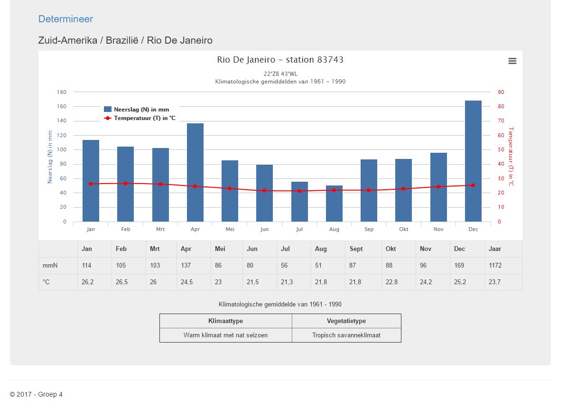

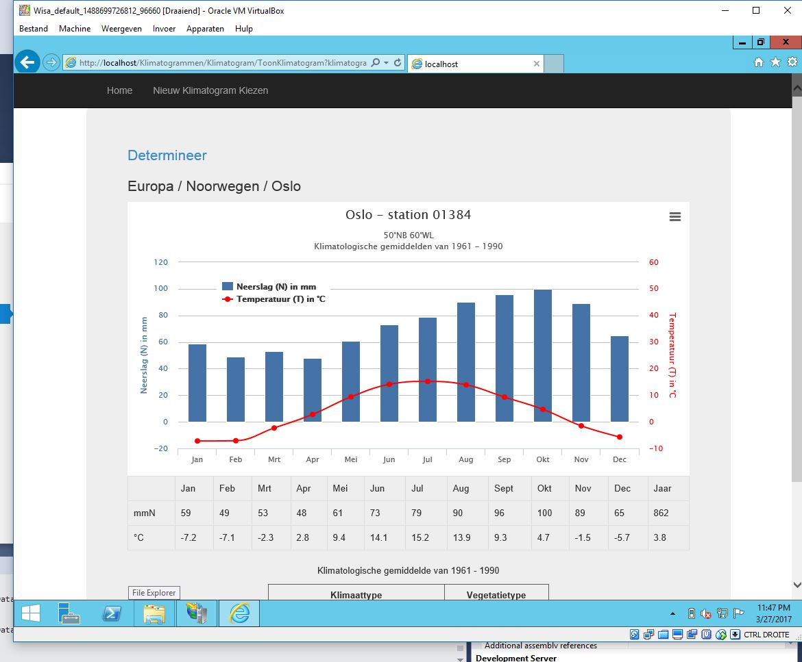
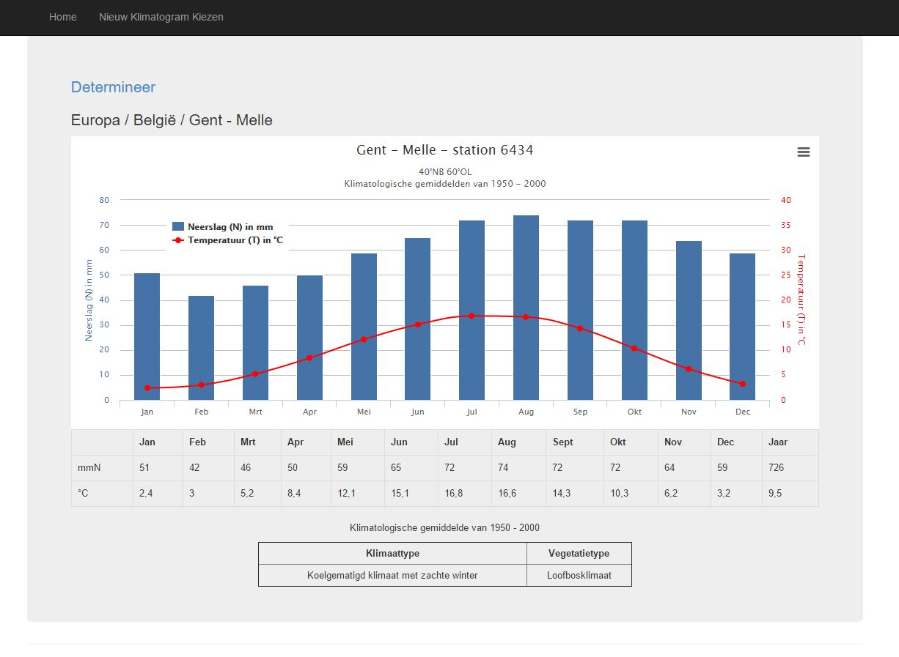

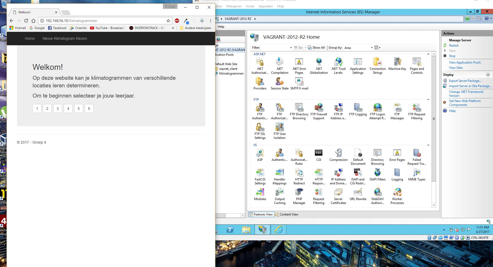

