# Testrapport WISA

Uitvoerder(s) test: Bracke Laurens
Uitgevoerd op: 05/03/2017

## Opzetten website via Powershell

**Verwacht resultaat: Er moet een website opgestart worden.**

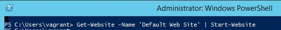

We voeren het commando "Get-Website -Name 'Default Web Site' | Start-Website" uit. 

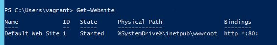

Je kan zien dat de Default website is aangemaakt en draait!

Stel je wilt online gaan met je server => Om je published package te uploaden (Visual Studio -> Build -> Publish project (maakt een .ZIP).

## Controleren installatie IIS en ASP.NET

**Verwacht resultaat: Beide moeten geïnstalleerd zijn.**

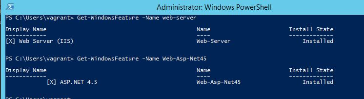

Typ `Get-WindowsFeature -name web-server` en `Get-WindowsFeature -Name Web-Asp-Net45` om te weten of beide geinstalleerd zijn.

## Controleren installatie (websites) IIS Management Console

**De huidige (indien geen toegevoegd zal de default website alleen verschijnen) website wordt getoond.**

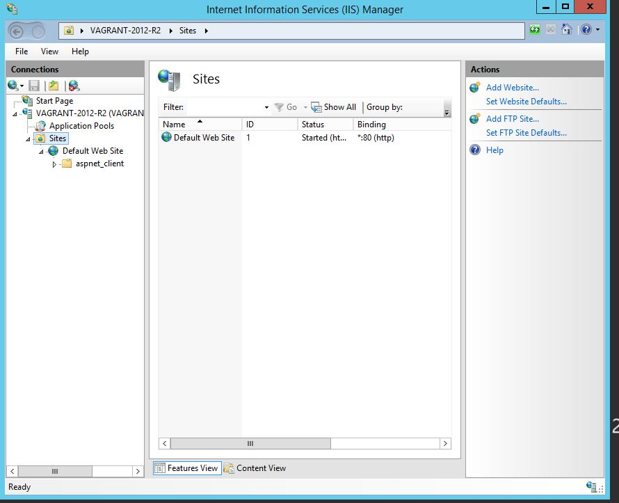

_2 mogelijkheden:_

1. Typ`inetmgr` in Windows-Run (Windowsknop + R). Bekijk dan bij Sites: Sites -> Connections (als je een configuratiescherm krijgt dan is IIS geïnstalleerd).
2. Typ `Get-Website` om de actieve websites te zien, een poort kan maar 1 actieve website ondersteunen.

## Controleren connectie via Powershell

**Verwacht resultaat: Er mogen geen foutboodschappen verschijnen.**

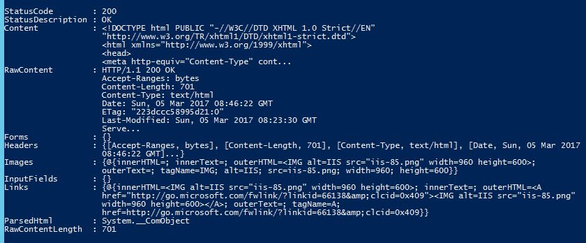

Als we `Invoke-WebRequest <ip-adres>`ingeven, verschijnt er gewoon informatie, geen foutboodschappen.

## Controleren installatie MySQL

**Verwacht resultaat: MySQL werd correct geïnstalleerd (met de juiste versie).**

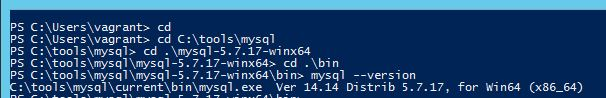

We voeren in: `C:\MySQL\mysql-5.7.17-winx64\bin>mysql --version"`

Uitvoer= `mysql  Ver 14.14 Distrib 5.7.17, for Win64 (x86_64)`

## Controleren default/dummy databank MySQL

**Verwacht resultaat: de databanken wordt getoond, zie afbeelding.**

In de MySQL command line: typ " mysql -u root -p -e 'show databases;' ", dan wordt een paswoord gevraagd en krijg ik de databanken te zien.

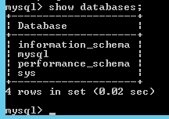

## Configuratie IP-toekenning en MAC-toekenning (PC)

- Heeft deze PC het correcte IP-adres, Default Gateway en Mac-adres toegekend gekregen?

**Verwacht resultaat: Bij `IP Address` staat het overeenkomstige IP-adres en Default Gateway. (Voor deze opdracht: Default Gateway werd nog niet geconfigureerd).**

**Verwacht resultaat: Bij `MAC Address` staat het overeenkomstige MAC-adres `080027C52EF7`.**

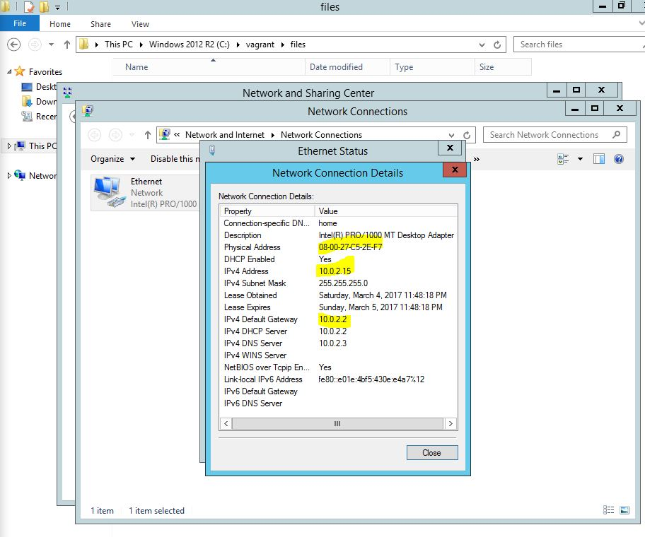

Deze gegevens heb ik teruggevonden via Windows server -> network and sharing center -> network connections -> details ethernet. Deze gegevens kan je ook terugvinden via jouw hostmachine (vagrant).

## SSH-connectie

- Is het mogelijk om via Vagrant de VM te verbinden via SSH?

**Verwacht resultaat: Het is mogelijk om via Vagrant verbinding te maken met de VM.**

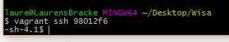

Er wordt inderdaad een ssh-connectie opgestart waarin ik commando's kan uitvoeren op de VM.

## Map files op VM

- Staan de meegeleverde bestanden (map: `files`) op de virtuele machine?

**Verwacht resultaat: Deze zouden normaal gezien meegeleverd moeten zijn.**

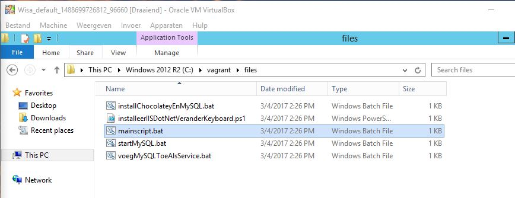

De map files is inderdaag zichtbaar in de VM, de bestanden zijn zichtbaar en bruikbaar.

## Werd MySQL toegevoegd als aan PATH?

**Verwacht resultaat: `mysql -u root -p` intypen in CMD zou herkend moeten worden (en je op de login terecht laten komen).**

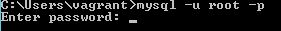

Als we deze gegevens ingeven, krijgen we inderdaad direct de vraag voor het paswoord.

## Heeft de aangemaakte gebruiker in de VM als naam `Vagrant` met paswoord `vagrant`?

**Verwacht resultaat: De standaardgebruiker moet `Vagrant` zijn met paswoord `vagrant`.**

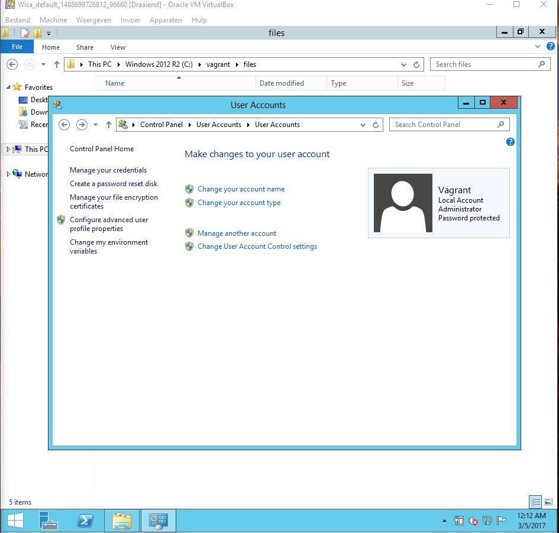

Je kan inderdaad op de afbeelding zien dat er 1 lokale gebruiker is genaamd Vagrant, en ik kon op dit account inloggen met het paswoord vagrant.

## Staat `ExectionPolicy` op de VM op `Unrestricted`?

**Verwacht resultaat: De `ExectionPolicy` moet op `Unrestricted` staan.**

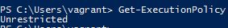

Als ik intyp "Get-ExecutionPolicy", verschijnt er Unrestricted.

## Worden de scripts correct uitgevoerd?

**Verwacht resultaat: Er komen geen foutboodschappen op (buiten de, ondanks successvolle, installatie van MySQL via Chocolatey).**

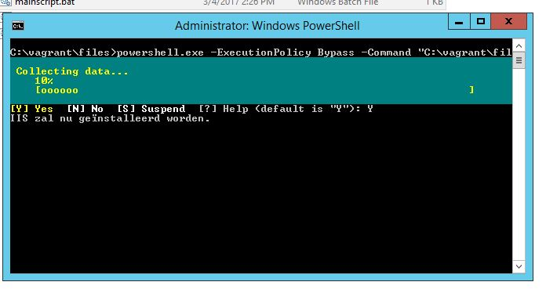

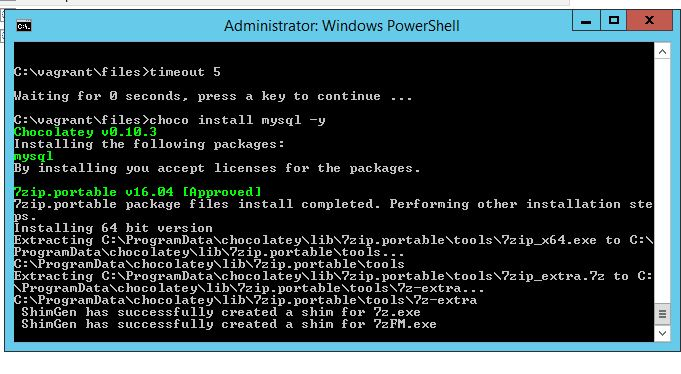

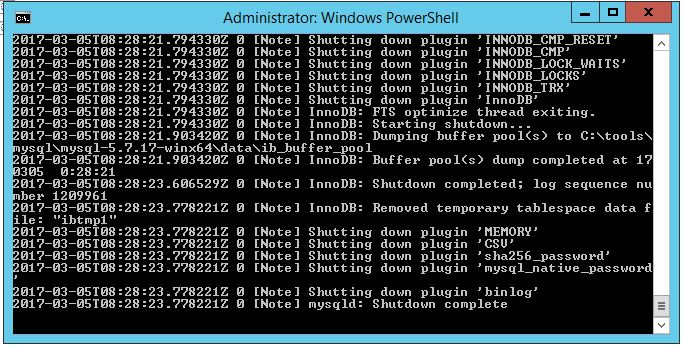

Alles installeert inderdaad vlot. Er verschijnen inderdaad rare rode meldingen van fouten, maar toch wordt de installatie van MySQL toch goed uitgevoerd.
