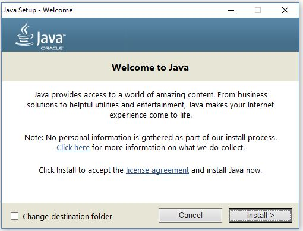
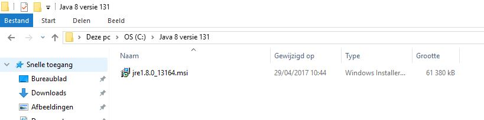
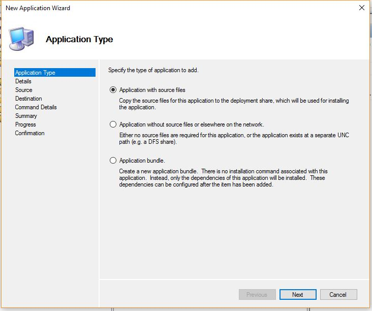
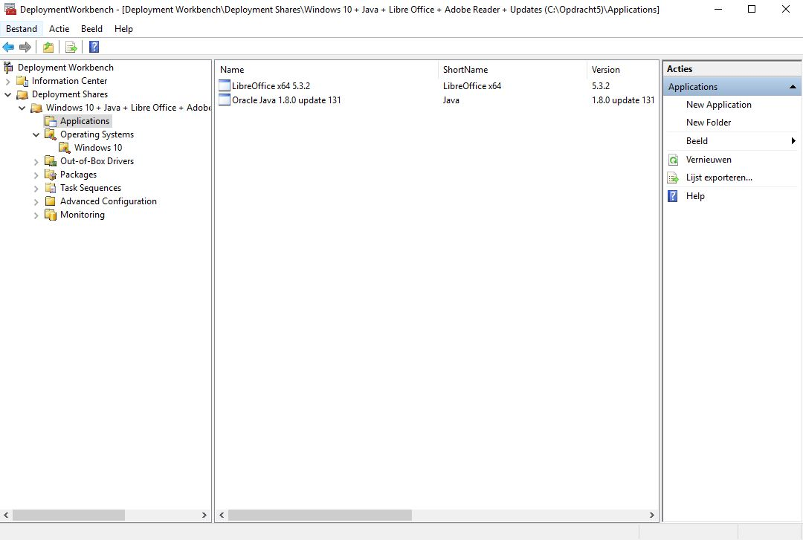
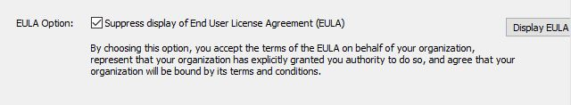

# Handleiding MDT 2013 (Update 2)

[Downloadlink](https://www.microsoft.com/en-us/download/details.aspx?id=50407)

Na de download kan je in start ingeven "Deployment Workbench" om het programma te openen.

Microsoft Deployment Toolkit is een programma dat toestaat om via een netwerk Microsoft Windows en andere programma's te installeren op PC's die zijn aangesloten op het netwerk. Dit programma wordt in vele bedrijven gebruikt om ervoor te zorgen dat alle computers met dezelfde applicaties kunnen werken. 

MDT bevat vele belangrijke functies zoals de support voor Windows Clients, Servers, support van Powershell, de mogelijkheid om locale administrator accounts toe te voegen aan computers, monitoring van alle activiteiten, installeren en/of toevoegen aan een server enzovoort. Je kan ook in de laatste versies van MDT bestaande Windows-installaties (windows 7-8) upgraden naar Windows 10, waarbij alle data, instellingen, applicaties en drivers direct mee worden aangepast.

Om ervoor te zorgen dat we deployment kunnen doen van Windows 10 in MDT, dan moeten we ook Windows ADK for Windows 10 installeren.

The Windows ADK is een collectie van tools en documentatie om Windows besturingssystemen na te kijken, aan te passen en te deployen.

Je kan deze downloaden [via volgende link](https://developer.microsoft.com/en-us/windows/hardware/windows-assessment-deployment-kit)
Ik heb hier gekozen voor `ADK for Windows 10, versie 1703`.

[Meer uitleg over ADK](https://technet.microsoft.com/en-us/library/hh825486.aspx)

Na het toevoegen van ADK, kunnen we een nieuwe Deployment Share toevoegen in MDT 2013. Een Deployment Share is een verzameling van het operating system dat je wilt implementeren op een referentie-pc, met daarbij alle nodige programma's toegevoegd.

[Meer info](https://technet.microsoft.com/en-us/library/dn759415.aspx)

Nadat de Deployment Share is gecreëerd (zie afbeelding), kunnen we aan de Deployment Share een OS toevoegen. We kiezen hier voor Windows 10 (64 bit, Education-versie, Engels).

<!---
## Handleiding installatie Windows 10

### Dit is de manier van Robin, op voorhand installeren en dan toevoegen van wim-file aan deployment share

1. Download de .ISO (Windows 10 Education: `en_windows_10_education_version_1703_updated_march_2017_x64_dvd_10189297`).
2. Open de .ISO in VirtualBox en installeer deze op een VM.
3. Laat de taalinstellingen staan maar kies als keyboard-lay-out: `Belgian (comma)`. Klik op "Next" en "Install Now".
4. Geef eventueel de license key in en klik op "Next". Accepteer dan de licentievoorwaarden. 
5. Kies voor een "Custom"-installatie en maak geen partities. Nu zal de installatie plaatsvinden.
6. Na de installatie

## Afbeeldingen

-->

## Manier van Laurens, direct Windows 10 ISO importeren in Deployment Share

LINK ZEKER DOORLEZEN!

https://docs.microsoft.com/en-us/windows/deployment/deploy-windows-mdt/create-a-windows-10-reference-image

Om nu de ISO-file te laten inlezen, moeten we eerst deze ISO-file uitpakken in Windows (plaats naar een map met een relatief kort pad vb. C:/Windows64Education) of we kunnen deze ISO virtueel laten draaien op onze PC, alsof deze zich bevindt in de DVD-drive van jouw pc (ik gebruik deze manier, en ga hiervoor gebruikmaken van het programma PowerISO). Indien je gebruik maakt van de 2de optie, zal de ISO zich manifesteren in een nieuwe drive, hier `F:/`.

Nu zijn we dus klaar om de ISO te importeren in de Deployment Share.

Nadat deze dan is geïmporteerd, kan je deze image hernoemen zoals gewenst:

## Toevoegen van applicaties

Het toevoegen van applicaties kan je via de grafische interface doen, of via Windows Powershell. Telkens je een applicatie toevoegt, is het belangrijk om aan het installatiebestand toe te voegen welke versie het is, voor welke platformen en of het werkelijk een installatie zal doorlopen (Install) ofwel een configuratie is van een programma (Configure).

Eerste gaan we de verschillende applicaties downloaden die nodig zullen zijn:

### Toevoegen Java

[Gebruikte info](https://mdtguy.wordpress.com/2014/02/17/installing-the-latest-java-re-msi-with-mdt-2013/)

Eerst gaan we de offline installer downloaden van de Java Website, zodat wanneer de stille installatie moet gebeuren op de image, deze geen connectie hoeft te maken met het internet.

[Downloadlink nieuwste Java (English)](https://www.java.com/en/download/) Selecteer daar om alle Java downloads te zien, gebruik dus niet de webinstaller. We zullen hier dus kiezen voor `Version 8 Update 131` van Java.

Na de download krijg ik een bestand met naam: jre-8u131-windows-x64.exe. Vervolgens plaats je het in een map waar je het gemakkelijk zal terugvinden (ik heb hier gekozen om te plaatsen in `C:/`).

MDT maakt voor applicaties het liefst gebruik van een msi-file ipv een exe-file voor installatie. Daarom zullen we eerst op onze hostmachine deze java.exe opstarten (niet volledig installeren!!!), hierdoor komt in de verborgen mappen een msi-bestand vrij van deze java-versie, die we dan zullen importeren in onze Deployment Share.

We klikken niet door, we laten gewoon de exe-file staan op het welkom-bericht.
Zie wat we nu terugvinden in de verborgen mappen van de hostmachine...

Kopieer alles wat zich in deze map bevindt naar een veilige plaats, zodat je er later in MDT gemakkelijk naar kan verwijzen, na het kopieren naar een veilige locatie kan je de exe afsluiten en verwijderen.

Nu kunnen we deze msi importeren naar MDT!

We gaan alle applicaties verplaatsen naar de deployment share, zo zijn we zeker dat alle applicaties allemaal uiteindelijk binnen 1 grote map terug te vinden zijn.

Het commando-line dat ik heb meegegeven in de command details: 

`msiexec.exe /qb- /l*vx %LogPath%\jre1.8.0_13164.log REBOOT=ReallySuppress ALLUSERS=TRUE /I jre1.8.0_13164.msi`

Ziezo, nu is Java 1.8.0 update 131 toegevoegd aan je deployment share.

### Toevoegen LibreOffice

Info-links : 

https://www.libreoffice.org/get-help/install-howto/windows/

http://lodahl.blogspot.be/2011/11/silent-installation-following-up.html

https://wiki.documentfoundation.org/Deployment_and_Migration

https://community.spiceworks.com/topic/259347-libre-office-silent-install

Link om LibreOffice 5.3.2 (zowel voor x86 als x64) te downloaden: 

https://www.libreoffice.org/download/download/?type=win-x86_64&version=5.3.2&lang=en-US (dit is een msi-bestand)

We gaan deze msi-file weer verplaatsen naar een aparte map, zodat we later gemakkelijk dit bestand kunnen importeren voor mdt

Nu gaan we weer het hele pad doorlopen om de msi toe te voegen aan de deployment share

We gaan alle applicaties verplaatsen naar de deployment share, zo zijn we zeker dat alle appilcaties allemaal uiteindelijk binnen 1 grote map terug te vinden zijn!

Het commando-line dat ik heb meegegeven in de command details (allemaal 1 lange lijn!) (meer info vind je hierover in de info-links hierboven Robin, lees dus de links hierboven, zodat we allebei zeker zijn dat ik hier goed bezig ben): 

`msiexec /qb /i LibreOffice_5.3.2_Win_x64.msi /l* LibreOffice_install_log.txt REGISTER_ALL_MSO_TYPES=1 UI_LANGS=en_US ISCHECKFORPRODUCTUPDATES=0 REBOOTYESNO=No QUICKSTART=0 ADDLOCAL=ALL VC_REDIST=1 REMOVE=gm_o_Onlineupdate`

Hiermee voeg ik een paar zelfgekozen opties bij (zoals het verwijderen van woordenboeken die wij nooit zullen gebruiken)

Ziezo, nu is LibreOffice 5.3.2 toegevoegd aan je deployment share

### Toevoegen Adobe Reader 11

Links: 

https://mdtguy.wordpress.com/2013/08/27/how-to-deploy-adobe-reader-xi-msi-with-mdt-2012/

https://forums.adobe.com/thread/1344178

http://www.sysadminlab.net/other/modify-the-installation-of-adobe-reader-for-mdt-sccm-or-other-deployment

Je kan alle offline msi-installers downloaden via ftp://ftp.adobe.com/pub/adobe/reader/win/11.x/11.0.00/en_US/

Wij kiezen hier voor de meest recente versie: Adobe Reader 11. Haal nu dus de msi af en plaats hem al in een aparte map

<!--

Vervolgens gaan we ook de Adobe Customization Wizard XI downloaden, om het installatiebestand om te zetten naar een mst-file die we dan gaan gebruiken in MDT 2013. Download via  [deze link](http://supportdownloads.adobe.com/detail.jsp?ftpID=5515) en installeer het.

Nu kunnen we de exe uitpakken zodat we een msi krijgen om mee te werken

Doe volgende stappen:

- Run (Win+R)
- voer uit `C:\AdbeRdr11000_en_US.exe -nos_ne`
- Er zal dan een map aangemaakt worden in: `%ProgramData%\Adobe\Setup`

Deze bestanden gaan we kopiëren naar een nieuwe map die we dan later gaan gebruiken voor te importeren in MDT 2013

Nu openen we Adobe Customization Wizard en gaan we deze bestanden aanpassen naar een MST-file die we dan gaan gebruiken in MDT 2013.
Klik bij File op importeren, en kies de msi-file van daarnet

Na deze instellingen kan je vervolgens via de knop in de menubalk 'Transform' -> Generate Transform een mst-file maken. Sla deze op met juist dezelfde naam als het msi-bestand, op dezelfde locatie.

-->

Nu kunnen we weer overgaan naar MDT2013 en Adobe Reader toevoegen aan de Development Share!

We gaan alle applicaties verplaatsen naar de deployment share, zo zijn we zeker dat alle appilcaties allemaal uiteindelijk binnen 1 grote map terug te vinden zijn!

Command line voor Adobe Reader:

`msiexec.exe /i AdbeRdr11000.msi /qn`

<!---->

Ziezo, nu is Adobe Reader toegevoegd aan je deployment share

### Toevoegen Windows Update

#### C++ en andere installeren

- Kies eerst: `New Application`.
- Kies voor `Application with source files`.
- Geef als `Application Name`: `Install – Visual C++ Redistributables`.
- Selecteer het bestand `Install-VisualCRedist.ps1` (verkregen van [deze site](https://www.scconfigmgr.com/2016/02/29/install-visual-c-redistributable-applications-with-powershell-in-mdt/)).
- Druk op `Next` totdat je een quiet install commando ingeven. Zet in dit veld volgende commando's: `powershell.exe -ExecutionPolicy ByPass -Command "& .\Install-VisualCRedist.ps1 -Architecture 'x64','x86' -ShowProgress -Verbose"`
- Maak vervolgens een nieuwe `Task Sequence`. 
- `Task sequence ID: REFW10X64`, `Task sequence name:` Windows updates, `Comments:` Install latest Windows 10 Updates
- Schakel `Disable this step` uit `Options` van `Windows Update (Post-Application Installation)` en `Windows Update (Pre-Application Installation)`.
- Maak dan een nieuwe groep via `Add -> New Group` met als naam= `Custom Tasks (Pre-Windows Update)`.
- Klik dan op `Add -> Roles: Install Roles and Features`. Kies als naam: `Install - Microsoft NET Framework 3.5.1` en selecteer `.NET Framework 3.5 (includes .NET 2.0 and 3.0)`.
- Voeg nog een applicatie toe via `Add -> General: Install Application`, kies als naam: `Install – Visual C++ Redistributables`,bij `Install a single application` kan je dan kiezen om de toegevoegde applicatie te selecteren.

## Image exporteren

Voor je de image exporteert naar een `.ISO`, verander de `Rules` (`Bootstrap.ini` en `CustomSettings.ini`): voeg volgende instellingen toe:

### BOOTSTRAP.INI
[Settings]

Priority=Default

[Default]

DeployRoot=`\\LAURENSBRACKE\Opdracht5$`

SkipBDDWelcome=YES

### CUSTOMSETTINGS.INI
[Settings]

Priority=Default

[Default]

_SMSTSORGNAME=Hogent

UserDataLocation=NONE

DoCapture=NO

OSInstall=Y

AdminPassword=bracke1994

TimeZoneName=Romance Standard Time

JoinWorkgroup=WORKGROUP

HideShell=YES

DoNotCreateExtraPartition=YES

ApplyGPOPack=NO

SkipAdminPassword=YES

SkipProductKey=YES

SkipComputerName=YES

SkipDomainMembership=YES

SkipUserData=YES

SkipLocaleSelection=YES

SkipTaskSequence=YES

TaskSequenceID=REFW10X64

SkipTimeZone=YES

SkipApplications=YES

SkipBitLocker=YES

SkipSummary=NO

SkipRoles=YES

SkipCapture=YES

SkipFinalSummary=NO

- Rechterklik op je Deployment Share en druk op `Update Deployment Share`.
- Geef in de opties mee dat je compressie wilt gebruiken voor de image.
- Wacht even en de `.ISO` zal aangemaakt worden in de map die je gebruikt hebt voor de Deployment Share (bvb: `D:\Windows ADK\Deployment Share Opdracht 5 Projecten II\Boot\`).

[USB Deployment](https://msdn.microsoft.com/windows/hardware/commercialize/manufacture/desktop/winpe--use-a-single-usb-key-for-winpe-and-a-wim-file---wim)

## Screenshots van de uiteindelijke installatie
Wanneer we dan deze iso inschakelen in Virtualbox, wordt er voor de werkelijke installatie onze credentials gevraagd, en moeten we vervolgens juist op deploy drukken, waarna de installatie van het besturingssysteem en de andere programma's volledig probleemloos verlopen.

## Offline ISO creëren

Door een offline ISO te creëren, zorgen we ervoor dat we geen Credentials en geen Deployment Path meer moeten opgeven. Het is dus zo gemakkelijk om deze ISO toe te passen op eender welke pc naar keuze, of die nu in het bedrijfsnetwerk zit of niet.

link die ik gebruikt heb: http://www.vkernel.ro/blog/creating-an-offline-mdt-deployment-media

Stap 1: maak in Advance Configuration -> New Selection Profile een nieuw profiel aan waarin je enkel plaatst wat je nodig zal hebben in de offline-iso (in dit geval de map Applications, Windows 10 en de map Task Sequence.

Stap 2: Vervolgens dunnen we voor dat Selection Profile een Media-map aanmaken. Dit doen we via Media -> New Media. Hierin specifieren we in welke map dit profiel en zijn iso moeten worden opgeslagen. Na deze stap zal je een map terugvinden die eruitziet zoals je oorspronkelijke Deployment Share, maar enkel bevat wat je nodig zal hebben voor jouw Offline ISO.

Stap 3: In de aangemaakte Media in Deployment Workbench kunnen we nu weer aanpassingen doen aan de CustomSettings.ini en de Bootstrap.ini, net zoals vroeger. Nu moet je er wel op letten dat je geen DeploymentPath moeten meegeven, en ook geen rekeningn moeten houden met userid, password en domain-name (de credentials).

Stap 4: als dit correct is ingesteld, kan je vervolgens dit alles opslaan en met de rechtermuisknop klikken op de Media en kiezen voor Update Media Content. Dit zal alle nodige bestanden werkelijk exporteren naar de Profile-map en daarin een ISO aanmaken die je kan gebruiken, onafhankelijk van het netwerk!

Stap 5: importeer deze iso weer in een nieuwe machine van Virtualbox, en je zal zien dat hij de stappen voor Deployment-share en credentials zal overslaan. Je hoeft dan enkel nog maar op Begin te drukken en de installatie verloopt dan probleemloos!

### Toegevoegd

- Extra netwerkkaart (Host-Only)
- New Task Sequence
- Aanpassingen Bootstrap.ini en andere .ini-bestand
- Volledig verwijderen .ISO en opnieuw genereren
- Invullen lokale (hostmachine) paswoorden etc?
- Host-only NIC toevoegen
- `cscript x:\deploy\scripts\Litetouch.wsf`
- net use * \\ROBINB\Opdracht5
