# Testrapport opdracht 5 : Automatisatie IT-Park
Uitvoerder(s) test: Bracke Laurens
Uitgevoerd op: 08/05/2017

### Versie van Deployment Workbench

**Verwachte resultaat: Je gebruikt de versie van Deployment Workbench die kan werken met Windows 10 Education x64.**

We gebruiken versie 6.3.8330, dit is de tweede update van MDT 2013, aangezien er op fora te vinden is dat met de eerste update problemen waren om Windows 10 te deployen.

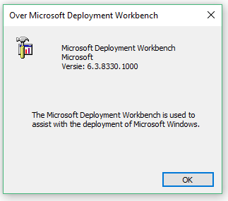
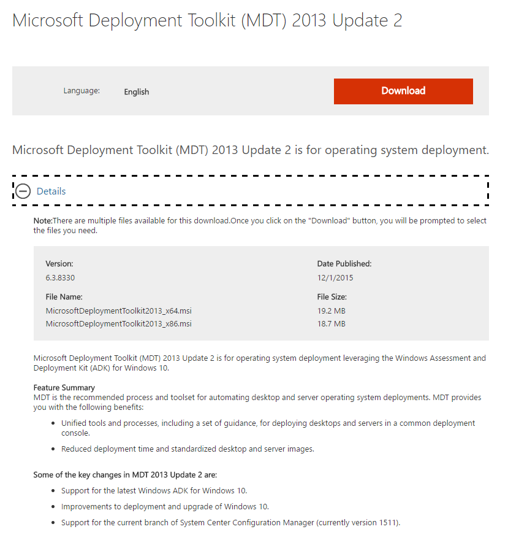

### Versie van ADK

**Verwachte resultaat: Je gebruikt de versie van ADK die kan werken met Windows 10 Education x64.**

We hebben ADK voor windows 10 gedownload en correct geïnstalleerd, plus we hebben ook bevestiging dat deze versie (1703) geschikt is om met Windows 10 te werken.

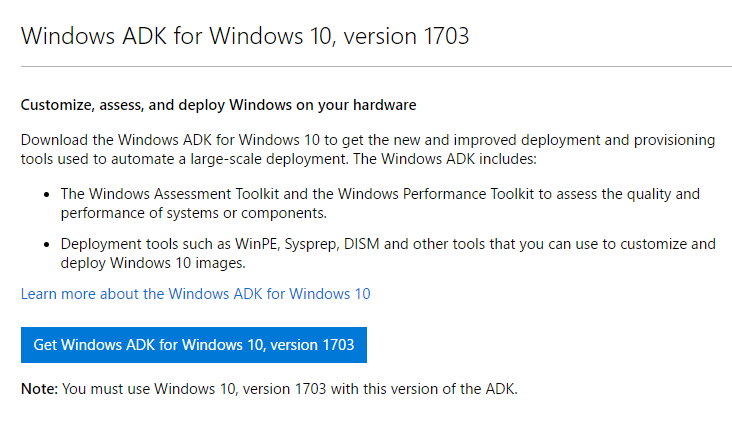
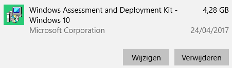

### Versie Windows

**Verwachte resultaat: Je gebruikt Windows 10 Education x64 - iso die we hebben van Dreamspark.**

De iso die gedownload is: en_windows_10_education_version_1703_updated_march_2017_x64_dvd_10189297.iso

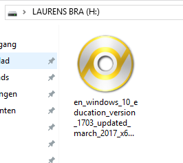

### Versie van programma's die we nodig hebben

**Verwachte resultaat: Je gebruikt telkens de msi die we gekregen hebben door duidelijk de downloadlinks in de handleiding te bekomen +  je benoemt de msi-bestanden zo dat duidelijk is welke versie van een programma je installeert.**

Elke map in onze deployment share bevat een msi-bestand dat de data bevat om de programma's in de deployment share te installeren.

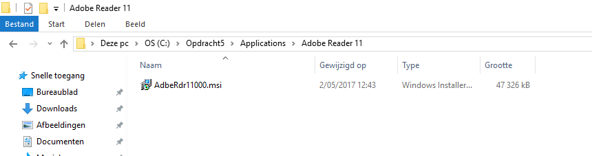
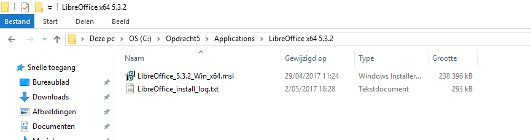
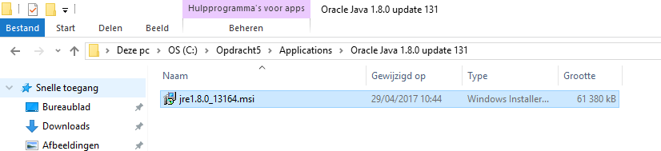

### Deployment workbench heeft in totaal 1 besturingssysteem, 3 programma's en 1 task-sequence in zijn Deployment Share staan na het toevoegen van de verschillende componenten

**Verwachte resultaat: Alles is terug te vinden met de juiste commando's voor elk, enkel Windows Updates vind je niet terug in hoofdschermen (die kan je vinden in de task sequence).**

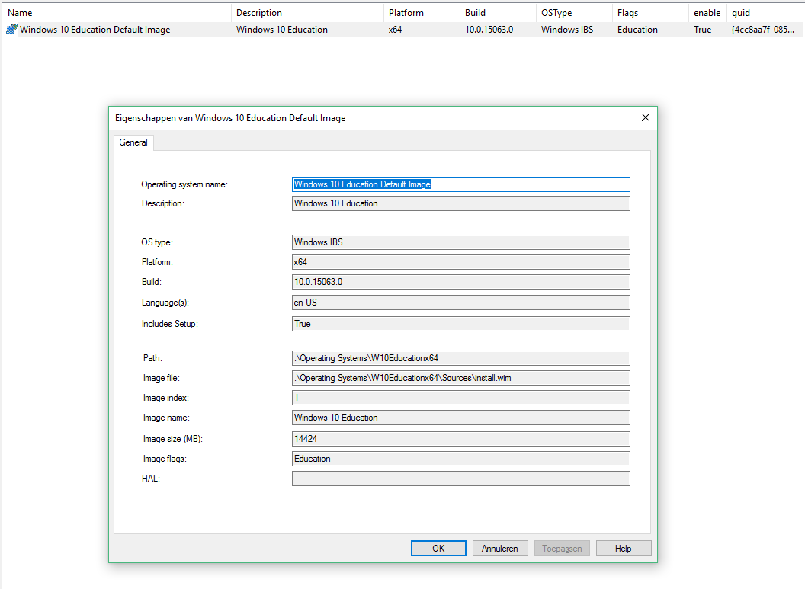
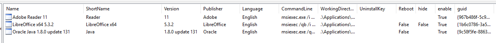
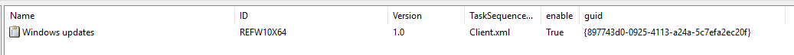

### De volgorde van de task sequence

**Verwachte resultaat: Eerst installatie van de programma's en het besturingssysteem voor de updates worden uitgevoerd.**

Als we doorklikken in de task sequence van onze Deployment Share, kunnen we zien hoe de installatie verloopt. 

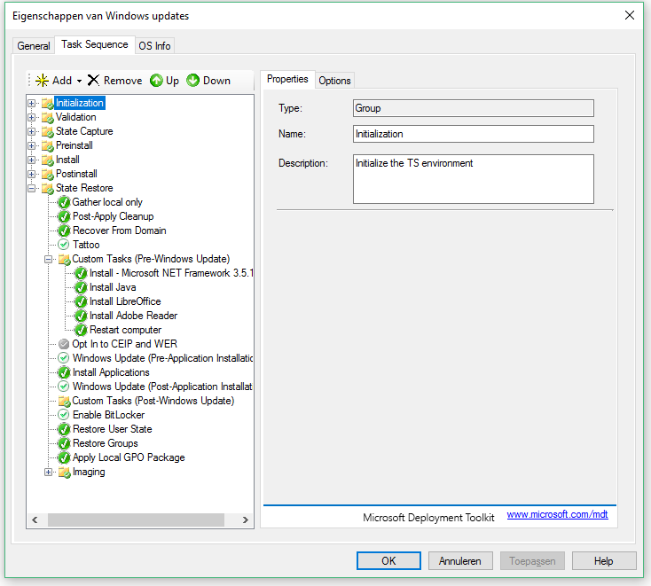

### ISO gebruiken in Virtualbox

**Verwachte resultaat: Wanneer Virtualbox-virtuele machine wordt opgestart, krijgen we direct de Microsoft Deployment Toolkit te zien.**

Eerst moeten we nog de credentials invoeren van ons netwerk voor we volgend scherm krijgen. Onze credentials maken gebruik van een netwerkmap op onze lokale machine.

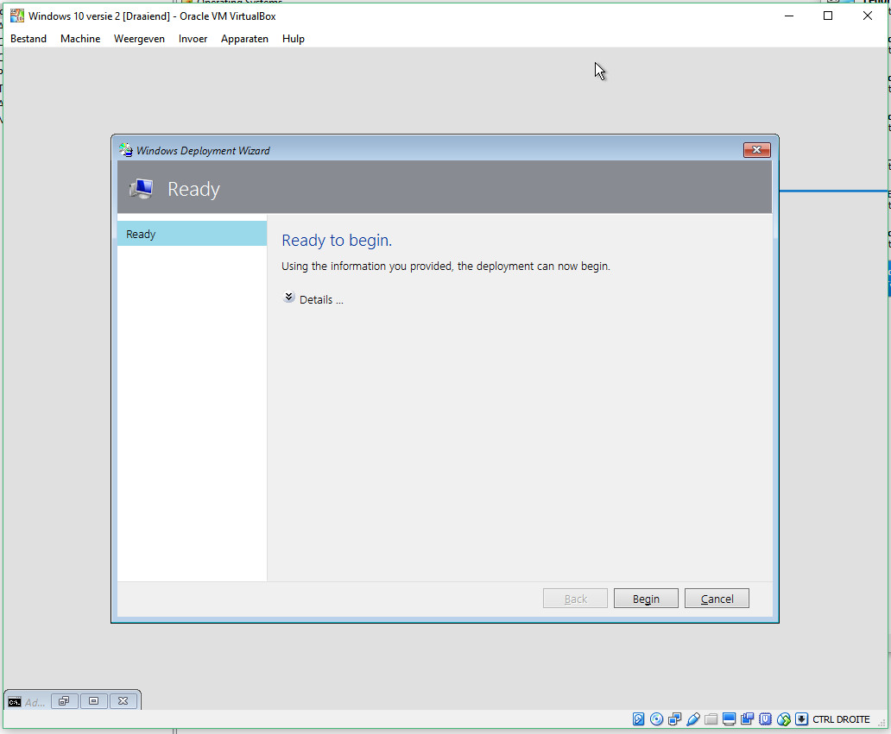

### Aantal muisklikken voor installatie

**Verwachte resultaat: Wanneer Virtualbox-virtuele machine wordt opgestart, moet er enkel nog de credentials ingegeven worden om je te legitimeren om deze share te installeren, waarna je vervolgens nog enkel op deploy moet drukken. Daarna gebeurt de volledige installatie uit zichzelf.**

Inderdaad, na credentials en druk op 'begin' in de deployment wizard, begint de installatie en wordt er verder geen interventie meer gevraagd aan de gebruiker. 

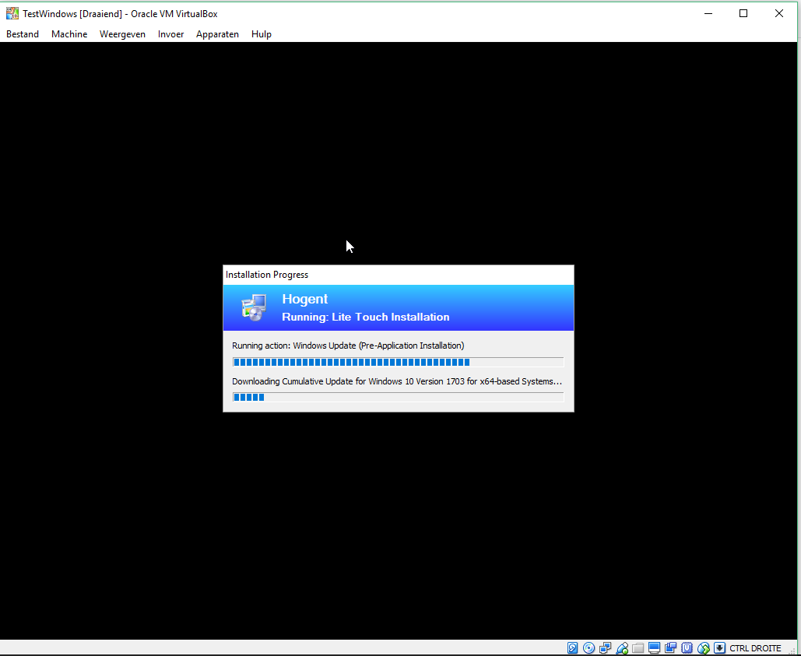

### Wat er gebeurt tijdens de installatie

**Verwachte resultaat: Normaal wordt er een aantal keer heropgestart, krijg je de hele tijd een zwart scherm met daarop een dialoogscherm dat aangeeft wat er op dat moment gebeurt.**

In totaal wordt er een 3-tal keer Windows gestart( 1 start na de installatie van de os, dan na de installatie van de programma's en dan nog 1 keer na de installatie van de updates).

### Controleren of de installatie correct verloopt op Virtualbox

**Verwachte resultaat: Windows Deployment geeft op het einde een summary zonder warnings en zonder errors aan de gebruiker.**

Er verschijnen inderdaad geen errors!

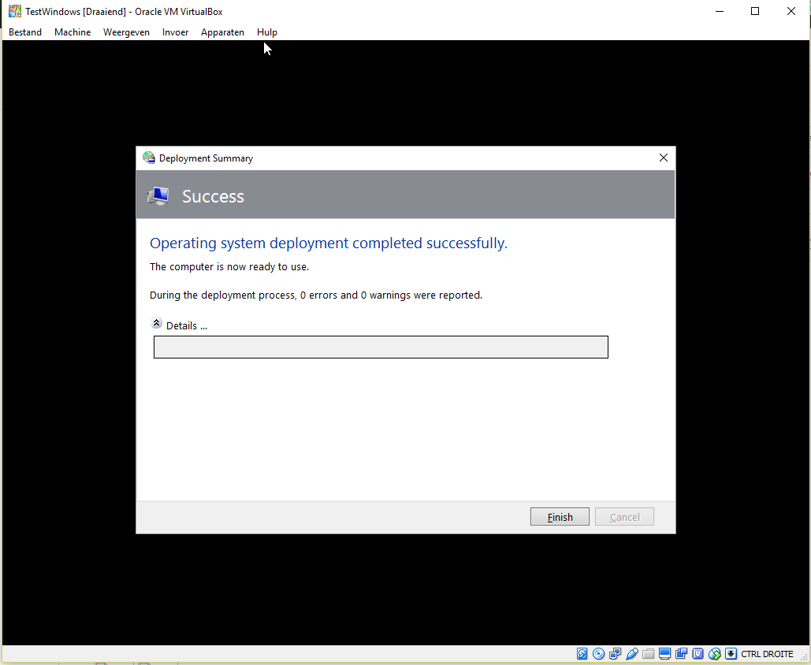

### Adobe Reader werkt correct

**Verwachte resultaat: Download eens een pdf, en open deze in je nieuwe machine.**

De pdf wordt probleemloos geopend.

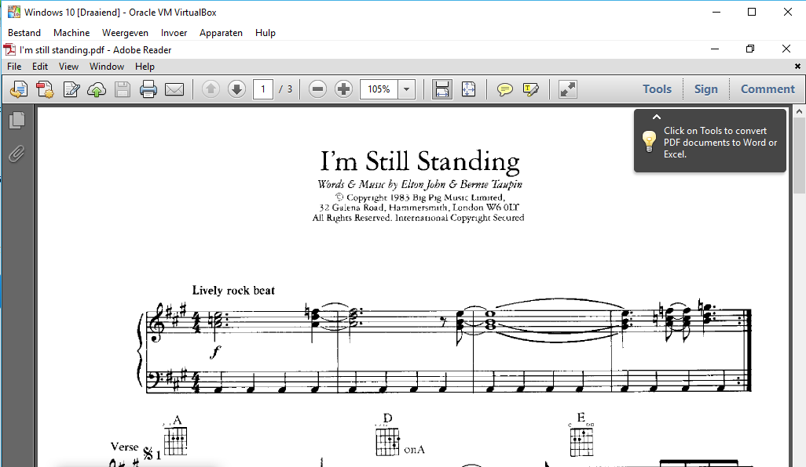

### LibreOffice werkt correct

**Verwachte resultaat: Download eens een doc-document, en open deze in je nieuwe machine.**

Er verschijnen geen fouten wanneer een odt of doc bestand wordt geopend op de virtuele machine.

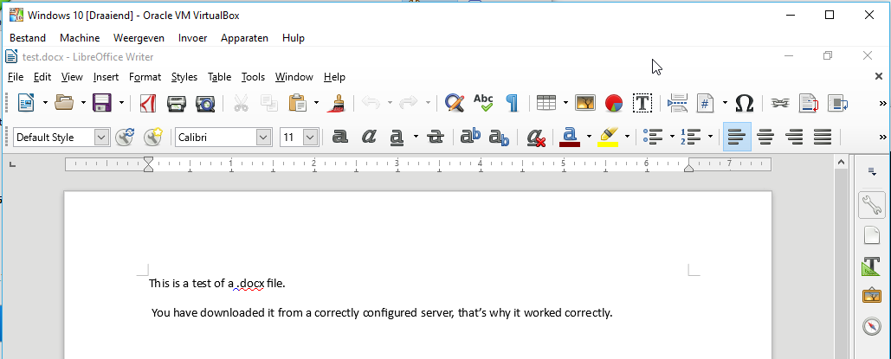

### Java werkt correct

**Verwachte resultaat: Verifieer of java correct is geïnstalleerd en correct reageert in command prompt**

Wanneer we in opdrachtprompt duiken, kunnen we nagaan dat Java correct is geïnstalleerd op deze machine.

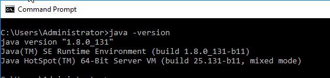
